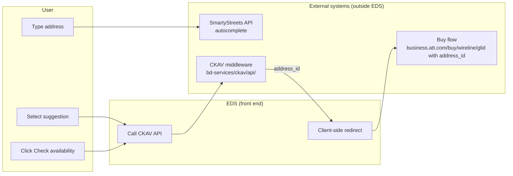
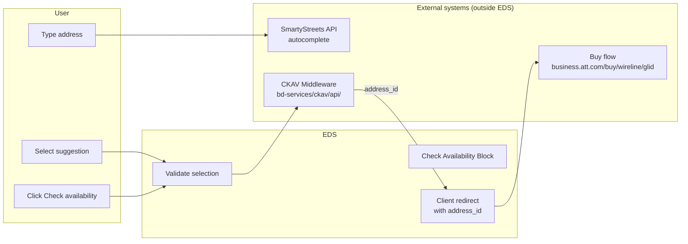
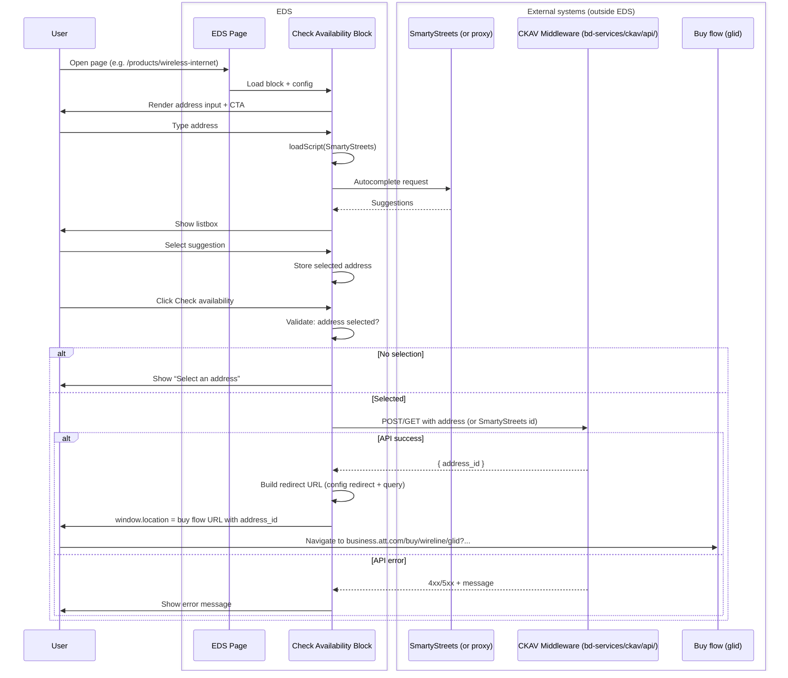
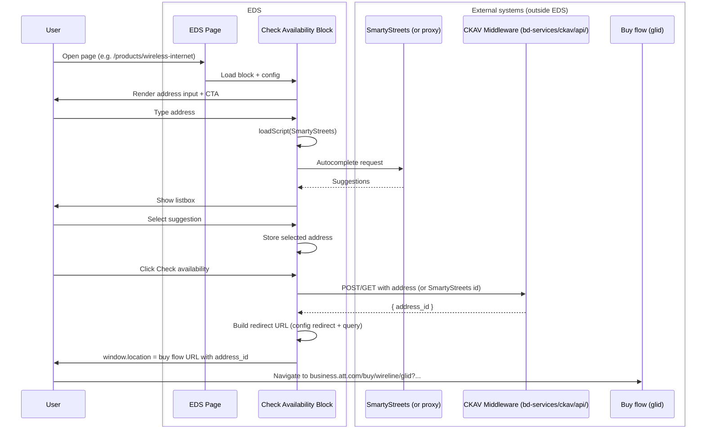

# Check Availability Form — EDS Migration Solution Design

This document provides a **solution design** for migrating the **Check Availability** form (address lookup + redirect to buy flow) from the current implementation at [business.att.com/products/wireless-internet.html](https://www.business.att.com/products/wireless-internet.html) to **AEM Edge Delivery Services (EDS)** with Universal Editor Crosswalk. The form uses **SmartyStreets** (external to EDS) for address autocomplete on the front end. The **existing Check Availability (CKAV) middleware** at `https://businessdigital.att.com/bd-services/ckav/api/` is used to resolve the address to an **address ID**; the front end then performs a **client-side redirect** to the buy flow (e.g. `https://www.business.att.com/buy/wireline/glid`) with that ID. **Akamai Edge Worker is not used** for this flow.

---

## 1. Current Implementation Analysis

### 1.1 Form Location and Purpose

- **Page:** [https://www.business.att.com/products/wireless-internet.html](https://www.business.att.com/products/wireless-internet.html)
- **Section:** “Enter your address to get started” / “Check availability”
- **Purpose:** Let the user enter an address, resolve it to an **address_id**, then send them into the **buy flow** (e.g. `https://www.business.att.com/buy/wireline/glid`) with that ID so availability and offers can be shown.

### 1.2 Form Elements and Flow

| Element | Role | Notes |
|--------|------|--------|
| **Address input** | Single textbox (`addressInput`) | User types address; **SmartyStreets** powers autocomplete (suggestions in a listbox). |
| **Clear button** | “Clear Input field” | Clears the address input. |
| **Autocomplete listbox** | Suggestions dropdown | Populated by SmartyStreets (or equivalent) as the user types. |
| **Check availability** | CTA button | On click: front end uses the **selected/validated address** to call a **separate backend/middleware API** that returns an **address_id**. Front end then performs a **client-side redirect** to the buy flow URL with `address_id` in the query. |

### 1.3 Address Autocomplete: SmartyStreets (External to EDS)

- **Provider:** [SmartyStreets](https://www.smarty.com/) (e.g. US Autocomplete, US Street API, or equivalent). **SmartyStreets is an external system outside EDS**; the EDS block calls its API (or a proxy) for address suggestions.
- **Behavior:** As the user types in the address field, the front end calls SmartyStreets (or a proxy) to get address suggestions and displays them in a listbox. The user selects one suggestion.
- **Note:** SmartyStreets may be called directly from the browser or via an internal proxy; API keys must not be exposed in client code (see Section 5).

### 1.4 Address ID: Existing CKAV Middleware

- **Behavior:** After the user selects an address (from SmartyStreets autocomplete), the **address_id** is **not** provided by SmartyStreets alone. The **existing Check Availability (CKAV) middleware** is used to validate/resolve the address and return an **address_id** that the AT&T buy flow understands.
- **API:** The address → address_id API is hosted on the **existing middleware** at **`https://businessdigital.att.com/bd-services/ckav/api/`**. An Akamai Edge Worker is **not** used for this flow.

### 1.5 Redirect Target and Client-Side Redirect

- **Redirect target:** [https://www.business.att.com/buy/wireline/glid](https://www.business.att.com/buy/wireline/glid) — user is sent into the **buy flow**.
- **Mechanism:** **Client-side redirect** managed by the front end. The front end calls the address-to-ID API; when the API returns a successful response containing **address_id**, the front end builds the redirect URL (e.g. with `address_id` and any required query params such as `customer_type=smallbusiness`) and sets `window.location` (or equivalent) to that URL. No server-side redirect is required for this step.

### 1.6 Current Flow Summary

---

## 2. Target Architecture: EDS Custom Block + CKAV Middleware

### 2.1 Approach: Custom Check Availability Block

- **Authoring:** Config is authored as a **regular block** (block table in the sheet/document). No separate spreadsheet for this form; block rows/cells define labels, placeholder, CTA text, redirect base URL, and (optionally) API endpoint URL for address-to-ID.
- **Rendering:** A **custom Check Availability block** on the EDS page reads block config, renders the address input, wires **SmartyStreets** (external to EDS) for autocomplete (via `loadScript` and block-scoped JS, not in `head`), and on “Check availability” calls the **existing CKAV middleware** at `https://businessdigital.att.com/bd-services/ckav/api/` to resolve address → **address_id**. On success, the block performs a **client-side redirect** to the buy flow URL with `address_id`.
- **Tech stack:** Plain HTML, modern CSS, vanilla JavaScript; aligned with [AEM Edge Delivery and good practices](https://www.aem.live/docs/dev-collab-and-good-practices) (no frameworks in critical path, third-party scripts via `loadScript`, etc.).
- **API:** The address → address_id API is the **existing CKAV middleware** only. Akamai Edge Worker is **not** used for this flow.

### 2.2 High-Level Target Flow (Left to Right)

The flow is a simple left-to-right sequence: user interaction on the EDS page → autocomplete (via external SmartyStreets) → validation → CKAV API call (external) → redirect to buy flow (external).

**Flow summary:**

| Step | What happens |
|------|----------------|
| **1. User** | Types address, selects a suggestion from autocomplete, clicks “Check availability”. |
| **2. EDS Block** | Renders form from block config; calls **SmartyStreets API** (external) via `loadScript` for autocomplete; validates that an address is selected. |
| **3. API** | Block calls **CKAV middleware** (external) (`https://businessdigital.att.com/bd-services/ckav/api/`) with the selected address; middleware returns `address_id`. |
| **4. Redirect** | Block builds buy flow URL with `address_id` (and optional params) and sets `window.location`. |
| **5. Buy Flow** | User lands on **buy flow** (external) `business.att.com/buy/wireline/glid` with `address_id` for availability and offers. |

---

## 3. Block Design: Config and Behavior

### 3.1 Block Config (Authored as Regular Block)

Authors edit the **block table** for the Check Availability block. Suggested structure (columns/cells):

| Config (example) | Purpose |
|------------------|--------|
| **Heading** | e.g. “Enter your address to get started” |
| **Placeholder** | e.g. “Address” |
| **CTA label** | e.g. “Check availability” |
| **Redirect URL** | Base URL for buy flow, e.g. `https://www.business.att.com/buy/wireline/glid` (query params such as `address_id` and `customer_type=smallbusiness` are appended by the block). |
| **API URL** (optional) | Endpoint for address → address_id. Default: `https://businessdigital.att.com/bd-services/ckav/api/`. If empty, block uses this default so authors don’t touch it in normal cases. |
| **Customer type** (optional) | e.g. `smallbusiness` for query string. |

All user-facing strings (heading, placeholder, CTA) come from **content** (block config), per [good practices](https://www.aem.live/docs/dev-collab-and-good-practices): “Strings that are displayed to end users… should always be authorable and sourced from content.”

### 3.2 Block Behavior

1. **Load:** Block decorator reads block config (heading, placeholder, CTA, redirect URL, optional API URL, customer type).
2. **Render:** Renders a section with heading, one address input, and a button (CTA). Optionally a “Clear” control. No autocomplete DOM until SmartyStreets is loaded.
3. **SmartyStreets:** Load SmartyStreets (or wrapper) via **`loadScript()`** in the block, not in `head.html`, to avoid LCP/TBT impact. Consider debounce on input and, if the script is heavy, `IntersectionObserver` so the script loads when the block is near the viewport.
4. **Autocomplete:** On input, call SmartyStreets (or proxy); show suggestions in a listbox; on selection, store the chosen address in block state.
5. **Check availability:** On button click, ensure an address is selected. If not, show an inline message. If yes, call the **CKAV middleware** (URL from config or default: `https://businessdigital.att.com/bd-services/ckav/api/`) with the selected address (or its SmartyStreets identifier).
6. **Redirect:** When the API returns success and **address_id**, build the redirect URL (e.g. `{redirectUrl}?customer_type=smallbusiness&address_id={address_id}`) and set `window.location` (client-side redirect). On error, show an error message and do not redirect.

### 3.3 Error Handling and Accessibility

- **No address selected:** Message near the button or input (e.g. “Please select an address from the suggestions.”).
- **API error (4xx/5xx):** Show a generic message (e.g. “We couldn’t check availability right now. Please try again.”); do not redirect.
- **Accessibility:** Use a single, visible address input with `aria-label` or associated label from config; listbox for suggestions with `aria-expanded` / `aria-activedescendant`; button with clear label; ensure focus order and keyboard support for suggestions.

---

## 4. Address → address_id API Contract (CKAV Middleware)

The following contract applies to the **existing CKAV middleware** at `https://businessdigital.att.com/bd-services/ckav/api/`.

### 4.1 Request

- **Method:** POST (or GET with query params if that’s the current contract).
- **URL:** Configured in the block (or env). Default: `https://businessdigital.att.com/bd-services/ckav/api/` (or the specific path used by CKAV for address → address_id).
- **Body (example for POST):** JSON such as `{ "address": { "street": "...", "city": "...", "state": "...", "zip": "..." } }` or a single line plus optional fields, depending on what the buy flow backend expects. Alternatively, the API could accept the **SmartyStreets response** (e.g. candidate ID or full normalized address) and return the **address_id** used by the buy flow.
- **Headers:** `Content-Type: application/json`, `Origin` / `Referer` from EDS site for CORS.

### 4.2 Response

- **Success (200):** Body includes **address_id**, e.g. `{ "address_id": "abc123..." }`. The front end uses this for the client-side redirect.
- **Validation failure (4xx):** Body with error message; front end shows message and does not redirect.
- **Server error (5xx):** Front end shows generic “try again” message.

### 4.3 CORS and Security

- **CORS:** Allow the EDS origin(s) that host the Check Availability block. Only required if the API is on a different host than the page.
- **Secrets:** No SmartyStreets (or other) API keys in client-side code. If SmartyStreets is called from the browser, use a **proxy** (e.g. CKAV middleware or other backend) that holds the key and calls SmartyStreets server-side; the block calls the proxy only.
- **PII:** Address and address_id are PII/sensitive; ensure TLS and compliance with privacy policy and data residency for the CKAV middleware.

---

## 5. End-to-End Sequence (Mermaid)

### 5.1 Full sequence (with error handling)

### 5.2 Happy path (no error handling)

---

## 6. EDS and AEM Best Practices Alignment

The solution follows [Development Collaboration and Good Practices](https://www.aem.live/docs/dev-collab-and-good-practices):

| Practice | Application |
|----------|-------------|
| **Content for strings** | All user-facing text (heading, placeholder, CTA, errors) come from **block config** (content), not hardcoded in JS/CSS. |
| **No third-party in `<head>`** | SmartyStreets (or proxy script) is loaded via **`loadScript()`** in the block, not in `head.html`. |
| **Minimal `<head>`** | No marketing or address scripts in `<head>`; keeps LCP/TBT acceptable. |
| **Frameworks** | No framework in critical path; vanilla JS in the block. |
| **CSS scoping** | Block CSS is scoped to the block (e.g. `.check-availability .input`). |
| **Mobile first** | Layout and styles are mobile-first; breakpoints as needed (e.g. 600px, 900px, 1200px min-width). |
| **No sensitive data in client** | SmartyStreets API key (if any) is only in proxy/middleware or Edge Worker; block only calls a backend that holds the key. |

---

## 7. Implementation Checklist (High-Level)

| # | Area | Action |
|---|------|--------|
| 1 | **Block** | Implement **Check Availability block**: config (heading, placeholder, CTA, redirect URL, optional API URL, customer type), single address input, CTA button. |
| 2 | **Autocomplete** | Integrate SmartyStreets via **loadScript()** (or proxy); debounce input; render suggestions in a listbox; store selected address in block state. |
| 3 | **API call** | On “Check availability”, call **address → address_id** API (URL from block config or default). Handle 200 (use `address_id`), 4xx, 5xx. |
| 4 | **Redirect** | On success, build URL from config redirect base + `customer_type` + `address_id` and set `window.location`. |
| 5 | **API** | Use the **existing CKAV middleware** at `https://businessdigital.att.com/bd-services/ckav/api/` for address → address_id; document contract and CORS. |
| 6 | **Secrets / proxy** | If SmartyStreets is called with a key, use a proxy (e.g. CKAV middleware or other backend) so the key is never in the client. |
| 7 | **CORS** | If API is on a different host than EDS, configure CORS for the EDS origin(s). |
| 8 | **Authoring** | Document block table columns so authors can edit labels, CTA, and redirect URL without code changes. |
| 9 | **Testing** | E2E: type address, select suggestion, click Check availability; verify redirect to `business.att.com/buy/wireline/glid` with correct `address_id`. Test error paths (no selection, API error). |

---

## 8. Resolved Decisions and Assumptions

### 8.1 Resolved

- **External systems (outside EDS):** **SmartyStreets API** (autocomplete), **CKAV middleware** (address → address_id), and **Buy flow** (glid) are all external to EDS; flow and sequence diagrams depict them as such.
- **Address autocomplete:** SmartyStreets (external to EDS); block calls its API via `loadScript` for suggestions.
- **Address ID:** From the **existing CKAV middleware** (external) at `https://businessdigital.att.com/bd-services/ckav/api/`; not from SmartyStreets response alone.
- **API:** **Existing CKAV middleware only.** Akamai Edge Worker is **not** used for check availability; the block calls the CKAV API (configurable URL, default as above).
- **Redirect:** **Client-side redirect** by the front end using the API response (`address_id`).
- **Redirect target:** **Buy flow** (external) — [https://www.business.att.com/buy/wireline/glid](https://www.business.att.com/buy/wireline/glid) (with `address_id` and any required query params).
- **Authoring:** Custom block with config authored as a **regular block** (block table), not a separate spreadsheet.

### 8.2 Assumptions

- The current production flow uses SmartyStreets for autocomplete and a separate service for address_id; redirect is client-side to the buy flow.
- EDS site will be on known domain(s) for CORS when calling the CKAV middleware.
- The buy flow accepts `address_id` (and e.g. `customer_type=smallbusiness`) on the query string; exact parameter names to be aligned with the live buy flow.

---

## 9. References

- [AEM Edge Delivery — Development collaboration and good practices](https://www.aem.live/docs/dev-collab-and-good-practices)
- Current page: [Business Fixed Wireless Internet \| AT&T Internet Air for Business](https://www.business.att.com/products/wireless-internet.html)
- Buy flow: [AT&T Business - Fiber Internet, 5G Broadband, Mobility](https://www.business.att.com/buy/wireline/glid)
- Project Lead Form EDS design: `LEAD_FORM_EDS_SOLUTION_DESIGN.md`

---

*Document version: 1.1. Check Availability form migration to EDS; address → address_id API uses existing CKAV middleware at https://businessdigital.att.com/bd-services/ckav/api/ only (no Akamai Edge Worker).*
