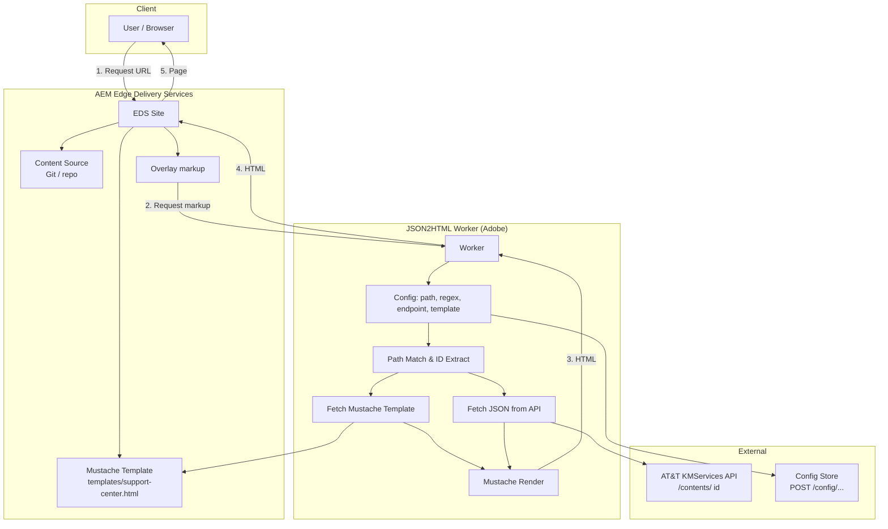
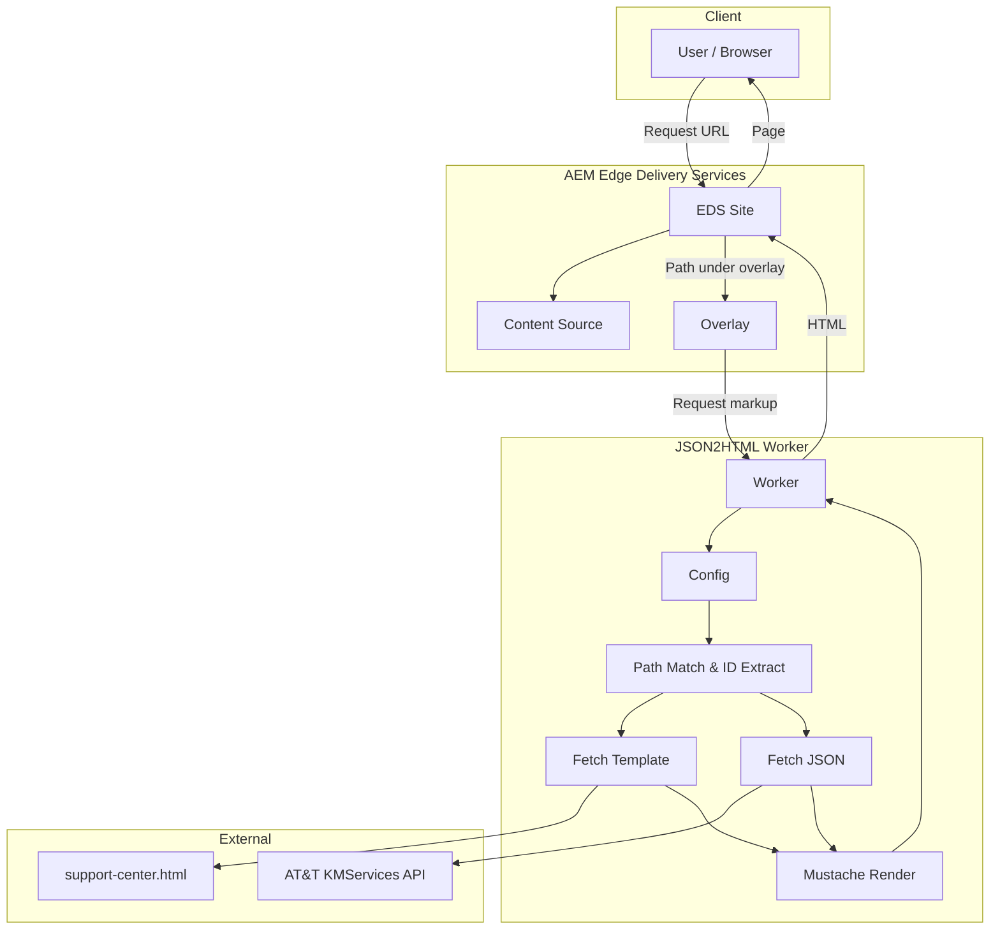
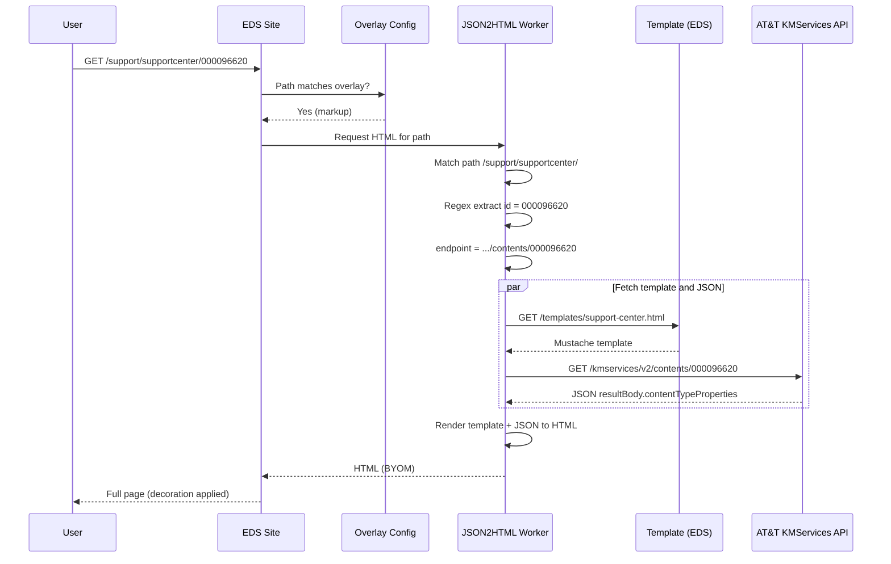
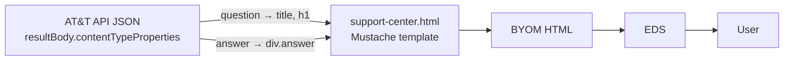

# JSON2HTML — High-Level Architecture & Data Flow

This document describes the architecture and data flow for the AT&T Support Center integration using Adobe’s JSON2HTML worker with AEM Edge Delivery Services (EDS). It aligns with the [JSON2HTML documentation](https://www.aem.live/developer/json2html) and the project’s customization in `templates/support-center.html`, `json2html.rest`, and the implementation docs.

---

## 1. High-Level Architecture

### 1.1 Component Overview

### 1.2 Architecture Flow (Detailed)

---

## 2. Data Flow

### 2.1 End-to-End Data Flow (Step-by-Step)

| Step | Actor | Action | Data |
|------|--------|--------|------|
| 1 | User | Opens URL | `https://main--att-demo--ak8458.aem.page/support/supportcenter/000096620` |
| 2 | EDS | Receives request, sees path under overlay | Path: `/support/supportcenter/000096620` |
| 3 | EDS | Asks overlay for markup | Request to `json2html.adobeaem.workers.dev/ak8458/att-demo/main` with path |
| 4 | JSON2HTML | Matches path to config | `path: "/support/supportcenter/"` → match |
| 5 | JSON2HTML | Extracts ID with regex | `/[^/]+$/` → `000096620` |
| 6 | JSON2HTML | Resolves endpoint | `https://services.att.com/kmservices/v2/contents/000096620?app-id=gmarket` |
| 7 | JSON2HTML | Fetches template | GET template from EDS: `/templates/support-center.html` |
| 8 | JSON2HTML | Fetches JSON | GET from AT&T API (step 6 URL) |
| 9 | JSON2HTML | Renders | Mustache(template, JSON) → HTML |
| 10 | JSON2HTML | Returns HTML | BYOM-friendly HTML to EDS |
| 11 | EDS | Serves page | Full HTML (with EDS decoration) to user |

### 2.2 Data Flow Diagram

### 2.3 JSON → Template → HTML (Support Center)

For this project, the AT&T API returns JSON that the template maps as follows:

| JSON Path | Template Usage | Purpose |
|-----------|----------------|---------|
| `resultBody.contentTypeProperties.question` | `{{resultBody.contentTypeProperties.question}}` | Page title, `<title>`, and `<h1>` |
| `resultBody.contentTypeProperties.answer` | `{{{resultBody.contentTypeProperties.answer}}}` | Answer body (HTML, unescaped) |

Flow:

---

## 3. Configuration Summary

| Concern | Value |
|--------|--------|
| **Overlay URL** | `https://json2html.adobeaem.workers.dev/ak8458/att-demo/main` |
| **Overlay type** | `markup` |
| **Path pattern** | `/support/supportcenter/` |
| **Regex** | `/[^/]+$/` (last path segment = content ID) |
| **Endpoint** | `https://services.att.com/kmservices/v2/contents/{{id}}?app-id=gmarket` |
| **Template** | `/templates/support-center.html` |
| **Config API** | `POST https://json2html.adobeaem.workers.dev/config/ak8458/att-demo/main` (see `json2html.rest`) |

---

## 4. File Roles

| File | Role |
|------|------|
| `templates/support-center.html` | Mustache template: maps AT&T JSON (`resultBody.contentTypeProperties`) to BYOM HTML. |
| `json2html.rest` | REST client: sends JSON2HTML config (path, endpoint, regex, template, headers) to the worker. |
| `JSON2HTML_QUICK_REFERENCE.md` | Quick reference: config snippet, overlay, test URL. |
| `JSON2HTML_IMPLEMENTATION.md` | Full implementation guide: setup, testing, troubleshooting. |
| **Content source** | Overlay added here so EDS uses JSON2HTML for matching paths. |

---

## 5. References

- [JSON2HTML for Edge Delivery Services](https://www.aem.live/developer/json2html) — official docs
- Project: `JSON2HTML_QUICK_REFERENCE.md`, `JSON2HTML_IMPLEMENTATION.md`
