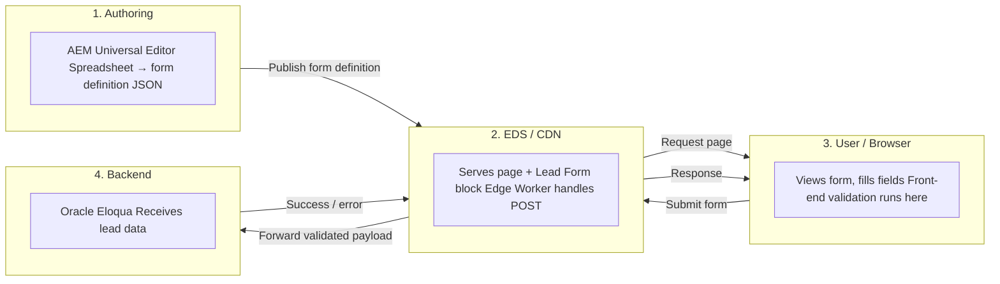
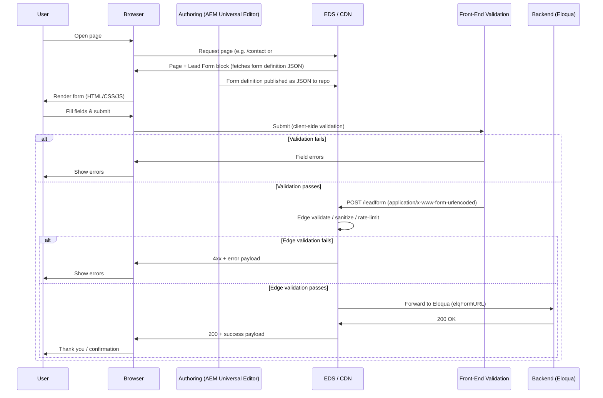
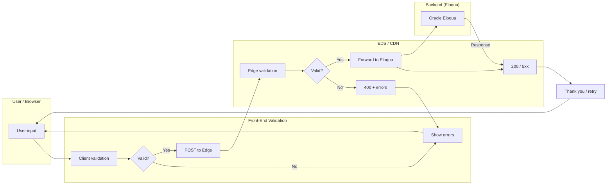
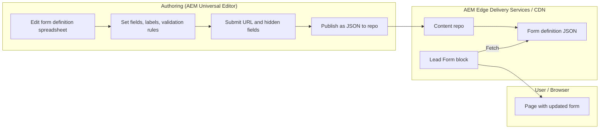

# Lead Form Migration to EDS Crosswalk — Solution Design

This document provides a **solution design** for migrating the AT&T Business lead form (RAI / Request Info form) from the current implementation at [business.att.com](https://www.business.att.com/) to **AEM Edge Delivery Services (EDS) Crosswalk**. Forms are rendered by a **custom Lead Form block** that consumes a **spreadsheet-authored form definition** (published as JSON). The backend POST endpoint migrates from a servlet to an **Akamai Edge Worker**, which forwards validated submissions to **Oracle Eloqua**.

---

## 1. Current Implementation Analysis

### 1.1 Form Location and Purpose

- **Page:** [https://www.business.att.com/](https://www.business.att.com/) (section “Talk to an AT&T Business sales expert”)
- **Anchor:** `#RAI-Form-Anchor` / “RAI Form Anchor”
- **Purpose:** Request contact from AT&T Business (lead capture / RAI — Request Additional Information)

### 1.2 Form Fields (Visible and Hidden)

**User-facing fields (and their validation rule fields):**

| Field (user-facing) | POST name      | Validation rule field | Validation value   | Notes |
|---------------------|----------------|------------------------|--------------------|--------|
| First name          | `firstName`    | `firstName_Val`       | `req;alpha;len=35` | Required, letters only, max 35 |
| Last name           | `lastName`     | `lastName_Val`         | `req;lname;len=35` | Required, letters/spaces/dashes, max 35 |
| Email address       | `emailAddress` | `emailAddress_Val`    | `req;email`        | Required, valid email |
| Phone               | `phone`        | `phone_Val`            | `req;phone`        | Required, 10-digit |
| Company name        | `company`      | `company_Val`          | `req;len=100`      | Required, max 100 chars |
| Add comment         | `comments`    | `comments_Val`        | `len=2048;`        | Optional, max 2048 chars |
| Newsletter opt-in   | `permissionOptIn1` | —                   | —                  | e.g. `Yes` when checked |

**User-visible error messages:**

- “Error: Enter a valid first name.”
- “Error: Enter a name that contains only letters.”
- “Error: Enter a valid last name.”
- “Error: Enter a name that contains only letters, spaces, and/or dashes.”
- “Error: Enter a valid email address.”
- “Error: Enter a valid 10-digit phone number.”
- “Error: Enter the name of your company.”
- “Error: Please limit comments to less than 2,048 characters”

*(No primary-product dropdown on this form; any legacy “Select a primary product” message can be omitted.)*

**Hidden / system fields (required for Eloqua):**

- **Eloqua / form identity:** `elqFormName=universal_form`, `elqFormNameOld=RAI-ENTDev`, `elqSiteID=1981585949`, `elqFormURL=https://s1981585949.t.eloqua.com/e/f2`, `raiformtype=base`
- **Sender / admin:** `senderName=Admin`, `senderEmail=baem@amcustomercare.att-mail.com`, `senderSubj=Request Info`
- **Form / page context:** `formLocation`, `formType=RAI`, `source=business.att.com`, `redirectURL1`, `activityCodeMostRecent1`, `sourceCode1`, `requestType1=reqaddlinfo`, `bypassSubType1=RAI/Contact Us`
- **Campaign / tracking:** `module=solutions`, `eloquaCampaignID`, `campaignID`, `eloquaSub=true`, and other tracking fields (e.g. `jobRole1`, `decisionTimeframe`, `emailStatus`, etc.)
- **Validation rule fields:** Each user field has a corresponding `*_Val` field sent in the POST (see table above).

### 1.3 Submission Endpoint and POST Contract

- **Current behavior:** Form **POST**s to **`https://www.business.att.com/leadform`** (servlet or server-side handler).
- **Post-migration:** POST will be handled by an **Akamai Edge Worker**, which forwards the validated payload to **Oracle Eloqua** (see Section 4).

**Current POST contract (from production):**

- **Method:** POST  
- **URL:** `https://www.business.att.com/leadform`  
- **Content-Type:** `application/x-www-form-urlencoded; charset=UTF-8`  
- **Headers (typical):** `Accept: */*`, `Origin: https://www.business.att.com`, `Referer: https://www.business.att.com/`, `X-Requested-With: XMLHttpRequest`  
- **Body:** All form fields as `application/x-www-form-urlencoded` (see Appendix A for the full field list from a sample request).

### 1.4 Front-End Validation Behavior

- **Client-side:** Validation runs before submit (required, format, length). Error messages appear next to/under fields; an alert area shows “Please fix the below request info form errors” when invalid.
- **Server-side:** The current `/leadform` endpoint likely validates again and returns success or error; success shows a “Thank you” message (and possibly “Go to Homepage”).
- **Success state:** “Thank you for contacting us about AT&T Business… An AT&T Representative will contact you shortly…”

---

## 2. Target Architecture: EDS Crosswalk + Spreadsheet-Driven Form Block

### 2.1 Approach: Custom Lead Form Block (Spreadsheet-Driven)

- **Authoring:** Authors maintain a **spreadsheet** (e.g. in SharePoint, Google Drive, or repo) that defines form fields, validation rules, labels, placeholders, and related attributes. The spreadsheet is published as **JSON** (e.g. `/forms/lead-form.json`) and stored in the content repo.
- **Rendering:** A **custom Lead Form block** on the EDS page references the form definition (e.g. by path or block config). The block’s decorator **fetches the JSON**, builds the form (inputs, labels, error areas), and wires validation and submit logic in plain HTML/CSS/JavaScript.
- **Tech stack:** Plain HTML, modern CSS, vanilla JavaScript; no pipeline wait—check-in to GitHub and content is live via EDS.
- **Submission:** Block JavaScript collects values (including hidden/Eloqua fields), runs client-side validation from the definition, then **POST**s `application/x-www-form-urlencoded` to the **Edge Worker** URL (configured in block or spreadsheet).

### 2.2 High-Level Flow Diagram

**Left to right:** who creates the form → who serves it → who uses it (and where validation runs) → who receives the data.

### 2.3 End-to-End Sequence (Mermaid)

Participants ordered left to right: **User** → **Browser** → **Authoring (AEM UE)** → **EDS / CDN** → **Front-End Validation** → **Backend (Eloqua)**.

---

## 3. Form Implementation on EDS: Custom Lead Form Block (Spreadsheet-Driven)

### 3.1 Content Model

- **Form block:** A single **Lead Form** block on the page references a **form definition** (e.g. path to JSON such as `/forms/lead-form.json` or a block config cell).
- **Form definition:** Authored in a **spreadsheet** (e.g. Excel, Google Sheets) and published as **JSON** in the repo. The spreadsheet defines fields, validation rules, labels, placeholders, error messages, and (optionally) submit URL and hidden-field defaults.

### 3.2 Spreadsheet Schema (Form Definition)

The form definition JSON (from the spreadsheet) should support at least:

| Column / property | Purpose |
|------------------|--------|
| **Field name** (POST name) | e.g. `firstName`, `emailAddress` — used as `name` and for submit payload. |
| **Type** | e.g. `text`, `email`, `phone`, `textarea`, `checkbox` — block maps to input type and validation. |
| **Required** | `true` / `false` — drives required validation and `*_Val` rule. |
| **Label** | User-visible label. |
| **Placeholder** | Placeholder text (optional). |
| **Validation rule** | e.g. `req;alpha;len=35`, `req;email`, `req;phone`, `len=2048;` — used for client validation and for `*_Val` in POST. |
| **Error message** | e.g. “Enter a valid first name.” — shown when validation fails. |
| **Max length** | Numeric (e.g. 35, 100, 2048) — used for validation and `len=…` in rule. |

Hidden/system fields (Eloqua identity, campaign, etc.) can be defined in the same sheet (with a “hidden” or “system” flag) or in a separate config (block config or env). The block merges user input with these when building the POST body.

### 3.3 Block Behavior

- **Load:** Block decorator reads the block content (e.g. link to `/forms/lead-form.json` or config). It **fetches the form definition JSON** from the repo.
- **Render:** From the definition, the block builds the form DOM: one row per field (label, input, error container). Input types and attributes (required, maxlength, etc.) come from the definition.
- **Validation:** On submit (and optionally on blur), the block runs validation using the definition (required, type, length) and displays the defined error messages. Validation rules align with the `*_Val` values sent in the POST (see Section 1.2 and Appendix A).
- **Submit:** Block JavaScript collects all field values (user + hidden), builds `application/x-www-form-urlencoded` body, POSTs to the **Edge Worker** URL (from definition or block config), and handles response (success → thank you; 4xx → show errors).

### 3.4 Submit URL and Hidden Fields

- **Submit URL:** Configured in the form definition (e.g. spreadsheet column or dedicated “config” sheet) or in the block’s config cell (e.g. different for preview vs production).
- **Hidden fields:** Values for Eloqua and tracking (e.g. `elqFormName`, `elqSiteID`, `formLocation`, `requestType1`, `bypassSubType1`, `elqFormURL`, etc.) are either authored in the spreadsheet (per form variant) or set in block/config so the block can merge them into the POST body.

---

## 4. Backend Migration: Servlet → Akamai Edge Worker

### 4.1 Role of the Edge Worker

- **Receive:** POST requests to a path such as `/leadform` or `/api/leadform` (same-origin or configured CORS).
- **Validate:** Re-validate required fields, formats (email, phone), and length (e.g. comment ≤ 2048). Reject with 400 and a clear payload if invalid.
- **Sanitize:** Escape/sanitize inputs to prevent injection.
- **Rate-limit / abuse:** Throttle by IP or token to limit abuse.
- **Forward:** Send validated payload to **Oracle Eloqua** (the current backend for this form). The form posts to an Eloqua endpoint (e.g. `elqFormURL` such as `https://s1981585949.t.eloqua.com/e/f2`); the Edge Worker will forward the same `application/x-www-form-urlencoded` body to Eloqua.
- **Respond:** Return 200 + success payload or 4xx + error payload so the EDS form can show thank-you or errors.

### 4.2 Edge Worker Contract (High-Level)

| Aspect        | Recommendation |
|---------------|----------------|
| **Method**    | POST only |
| **Content-Type** | `application/x-www-form-urlencoded; charset=UTF-8` (match current contract for compatibility with Eloqua). |
| **Request body** | Same field names as current form: `firstName`, `lastName`, `emailAddress`, `phone`, `company`, `comments`, `permissionOptIn1`, plus all hidden/Eloqua fields (see Appendix A). Include `*_Val` rule fields if the downstream expects them. |
| **Success**   | HTTP 200; body per current backend (or e.g. `{ "success": true, "message": "…" }` if Edge Worker normalizes response). |
| **Validation error** | HTTP 400, body e.g. `{ "success": false, "errors": [ { "field": "emailAddress", "message": "Enter a valid email address." } ] }`. |
| **Backend (Eloqua) failure** | HTTP 502/503 and optional retry; client can show generic “Please try again later.” |

### 4.3 Security and Compliance

- **HTTPS only** for the form and the Edge Worker.
- **CORS:** Allow only EDS/origin domains that host the form.
- **No sensitive secrets** in client; Edge Worker uses env/config to call backend (e.g. API keys).
- **PII:** Ensure handling of PII (email, phone, name, company) complies with privacy policy and data residency; document where data is sent from the edge (e.g. to which backend region).

---

## 5. Front-End and Form Validations

### 5.1 Client-Side (Browser)

- **Source:** Validation rules and error messages are driven by the **form definition** (spreadsheet/JSON). The Lead Form block reads required flag, type, validation rule, error message, and max length from the definition and runs validation on submit (and optionally on blur).
- **Rules (from definition):**  
  - First name: required, letters only, max 35 (`req;alpha;len=35`).  
  - Last name: required, letters/spaces/dashes, max 35 (`req;lname;len=35`).  
  - Email: required, valid email (`req;email`).  
  - Phone: required, 10-digit (`req;phone`).  
  - Company: required, max 100 (`req;len=100`).  
  - Comment: optional, max 2048 (`len=2048;`).
- **Messages:** Error messages are authored in the spreadsheet (e.g. “Enter a valid first name.”) and displayed by the block when validation fails.
- **UI:** Inline errors per field + optional alert “Please fix the below request info form errors” at top of form.
- **Accessibility:** Block renders with `aria-invalid`, `aria-describedby` for errors, and correct labels and focus order.

### 5.2 Server-Side (Edge Worker)

- **Duplicate** required and format checks so invalid payloads are rejected even if client is bypassed.
- **Length:** Enforce same limits (35, 35, 100, 2048) and return 400 with field-level errors when exceeded.
- **Sanitization:** Strip or escape values before forwarding to backend to reduce injection risk.

### 5.3 Validation Flow Summary

Left to right: **User/Browser** → **Front-End Validation** (in browser) → **EDS / CDN** (Edge Worker) → **Backend (Eloqua)**.

---

## 6. Configurability and Authorability

### 6.1 What Authors Can Change (Without Code)

Authors edit the **spreadsheet** (form definition). After the sheet is published as JSON and the content is updated in the repo, the Lead Form block fetches the new definition and renders the updated form. Authors can:

- **Add/remove/reorder fields** — add or remove rows in the sheet; block builds the form from the definition.
- **Change labels, placeholders, required flag** — edit the corresponding columns.
- **Set validation rules and error messages** — edit validation rule and error message columns; block uses them for client validation and for `*_Val` in the POST.
- **Change submit URL** — if the definition includes a submit URL column or a config sheet, authors can set it (e.g. per form variant or environment).
- **Edit hidden/system field defaults** — if hidden fields are defined in the spreadsheet (e.g. separate sheet or columns), authors can update Eloqua identity, campaign, etc.

The block code maps **type** (e.g. `email`, `phone`, `text`) to input type and validation behavior; authors do not need to change block code for normal field/label/validation updates.

### 6.2 What Requires Code or Config

- **Submit endpoint URL:** If not in the spreadsheet, set in block config or env (e.g. different for preview vs production).
- **Hidden/system fields:** If not in the spreadsheet, defined in block code or block config (e.g. form name, RAI type, page URL, campaign, `elqFormURL`).
- **Error/success copy:** Can be authored in the spreadsheet (e.g. error message column, success message row); otherwise in block or config.
- **Styling:** Theme and block-level CSS; authors do not change code unless adding new variants.

### 6.3 Authoring Flow (Conceptual)

Left to right: **Authoring (AEM Universal Editor)** → **EDS / CDN** → **User / Browser**.

*(Authors place the Lead Form block on the page and point it to the form definition path, e.g. in the block’s first cell or config; they do not author the form structure in a WYSIWYG editor.)*

---

## 7. Implementation Checklist (High-Level)

| # | Area | Action |
|---|------|--------|
| 1 | **Form block** | Build custom **Lead Form block** in EDS that consumes form definition JSON (from spreadsheet). |
| 2 | **Form definition** | Define spreadsheet schema (field name, type, required, label, placeholder, validation rule, error message, max length); publish as JSON (e.g. `/forms/lead-form.json`). Map current RAI fields and hidden/Eloqua fields to spreadsheet columns or config. |
| 3 | **Block render** | Block fetches JSON, builds form DOM (labels, inputs, error areas), wires validation from definition. |
| 4 | **Validation** | Client-side validation from definition (required, type, length); same rules enforced in Edge Worker. |
| 5 | **Submit** | Block collects values (user + hidden), builds `application/x-www-form-urlencoded` body, POSTs to Edge Worker URL; handle 200/4xx/5xx and show thank-you or errors. |
| 6 | **Edge Worker** | Implement Akamai Edge Worker: validate, sanitize, rate-limit, forward to **Eloqua** (same body format), return success/error response. |
| 7 | **CORS / security** | Configure CORS and backend credentials on the edge. |
| 8 | **Authoring docs** | Document for authors how to edit the form definition spreadsheet and (if applicable) submit URL and hidden fields. |
| 9 | **Testing** | E2E test: submit valid/invalid data; verify thank-you and error states and lead receipt in Eloqua. |

---

## 8. Resolved Decisions and Assumptions

### 8.1 Resolved

- **POST contract:** Documented from production cURL: `application/x-www-form-urlencoded`, full field list in Appendix A.
- **Backend:** The Edge Worker forwards the validated request to **Oracle Eloqua** (e.g. `elqFormURL` such as `https://s1981585949.t.eloqua.com/e/f2`).
- **Hidden fields:** All fields in the sample POST (including Eloqua identity, campaign, and `*_Val` rule fields) are required for Eloqua; the Edge Worker should forward them as-is (or derive only those agreed, e.g. `formLocation` from Referer).
- **Primary product:** No product dropdown on this form; no need to support “Select a primary product” in the EDS form.
- **reCAPTCHA / spam:** Not required for this migration.

### 8.2 Open Points (If Needed Later)

- **Analytics/tracking:** Whether the Edge Worker should emit analytics events on submit success/failure.
- **URL strategy:** Same-origin (e.g. `https://<eds-domain>/api/leadform`) vs dedicated Akamai hostname for the POST.

### 8.3 Assumptions

- The current site uses a single POST endpoint `https://www.business.att.com/leadform` for this RAI form; Eloqua receives the same payload today via the servlet.
- After migration, the Edge Worker sends the same body to Eloqua; only the entry point (servlet → Edge Worker) changes.
- EDS site will be on a known domain(s) for CORS.
- Authors have (or will have) access to the form definition spreadsheet and the published JSON in the repo.

---

## 9. References

- [AEM Forms — Developer](https://www.aem.live/developer/forms) (patterns for forms on EDS)
- Current lead form (section “Talk to an AT&T Business sales expert”): [AT&T Business](https://www.business.att.com/#RAI-Form-Anchor)
- Project EDS/JSON2HTML pattern: `JSON2HTML_ARCHITECTURE.md`

---

## Appendix A: Full POST Body Field List (from Sample cURL)

Sample request uses **Content-Type: application/x-www-form-urlencoded; charset=UTF-8**. Below are the keys and example/sample values from the production cURL.

**User-facing fields**

| Key | Sample value |
|-----|--------------|
| `firstName` | test |
| `firstName_Val` | req;alpha;len=35 |
| `lastName` | test |
| `lastName_Val` | req;lname;len=35 |
| `emailAddress` | test@test.com |
| `emailAddress_Val` | req;email |
| `phone` | 3127920000 |
| `phone_Val` | req;phone |
| `company` | sds |
| `company_Val` | req;len=100 |
| `comments` | (empty) |
| `comments_Val` | len=2048; |
| `permissionOptIn1` | Yes |

**Hidden / Eloqua and tracking fields**

| Key | Sample value |
|-----|--------------|
| `datalogs` | (empty) |
| `module` | solutions |
| `servicePortfolio` | en |
| `servPortId` | en |
| `resourceID` | en |
| `emailid` | 284 |
| `emailRecipients` | (empty) |
| `senderName` | Admin |
| `senderEmail` | baem@amcustomercare.att-mail.com |
| `senderSubj` | Request Info |
| `elqFormName` | universal_form |
| `elqFormNameOld` | RAI-ENTDev |
| `elqSiteID` | 1981585949 |
| `formLocation` | https://business.att.com/content/attbusiness/en.html |
| `formType` | RAI |
| `excludeCallCenter` | No |
| `solutionOfInterest` | (empty) |
| `eloquaCampaignID` | (empty) |
| `campaignID` | (empty) |
| `redirectURL1` | /content/attbusiness/en.html?&source=EPB235655051-ABS_AIA-B |
| `incomingTactic1` | (empty) |
| `activityCodeMostRecent1` | RAI_OT_MLT_BusHomepage_1224 |
| `sourceCode1` | EPB235655051-ABS_AIA-B |
| `source` | business.att.com |
| `eloquaSub` | true |
| `decisionTimeframe` | None |
| `selProdInterest` | (empty) |
| `productSolutionOfInterest1_1` | (empty) |
| `ElqCustomerGUID` | (empty) |
| `elqCookieWrite` | 0 |
| `jobRole1` | None |
| `jobTitle` | (empty) |
| `recvEmail` | no |
| `nxReg` | no |
| `exBusSeg` | Unknown |
| `emailStatus` | unknown |
| `requestType1` | reqaddlinfo |
| `bypassSubType1` | RAI/Contact Us |
| `faxnum` | (empty) |
| `elqFormURL` | https://s1981585949.t.eloqua.com/e/f2 |
| `raiformtype` | base |

The **Lead Form block** (and Edge Worker) must send the same keys so Eloqua continues to receive the expected payload. The form definition (spreadsheet) defines the user-facing fields that map to these POST names; hidden/Eloqua fields can be defined in the same definition (e.g. hidden-fields sheet) or in block config. Environment-specific values (e.g. `elqFormURL`, `formLocation`, `activityCodeMostRecent1`, `sourceCode1`) can be configured per environment in the definition or config.

---

*Document version: 1.2. Last updated: Feb 2026. Approach: spreadsheet-driven custom Lead Form block only.*
