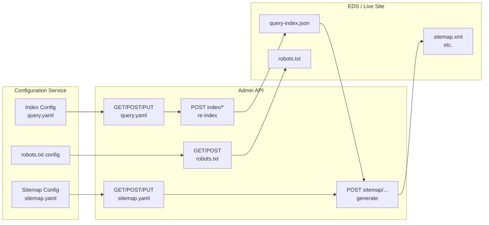
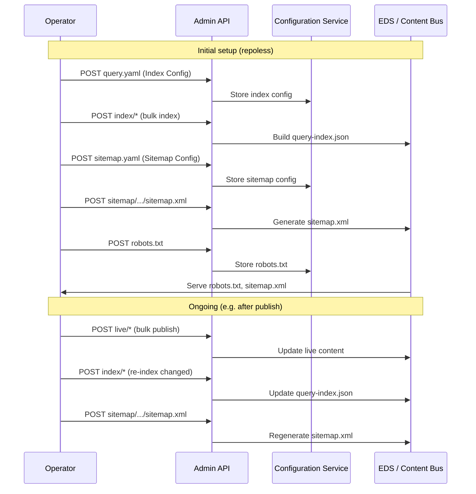

# Search Engine Optimization (SEO) for EDS Repoless Setup — Solution Design

This document provides a **solution design** for managing **Search Engine Optimization (SEO)** for [business.att.com](https://www.business.att.com/) and [firstnet.com](https://www.firstnet.com/) when using **AEM Edge Delivery Services (EDS)** with **Universal Editor Crosswalk** in a **repoless setup**. It covers how to manage **robots.txt**, how to create and maintain **sitemap.xml** (and sitemap index) from **query indexes**, and how to align with AEM best practices using the **configuration service** (no config files in a GitHub repo).

References: [AEM Documentation](https://www.aem.live/docs/), [Sitemaps](https://www.aem.live/developer/sitemap), [AEM Admin API](https://www.aem.live/docs/admin.html).

---

## 1. Scope and Context

### 1.1 Sites in Scope

| Site | Domain | Purpose |
|------|--------|---------|
| **AT&T Business** | business.att.com | Business marketing and support |
| **FirstNet** | firstnet.com | FirstNet authority and public safety |

Both sites will be delivered via EDS with content authored in **AEM Universal Editor** and published to the **Edge Delivery Services** content bus. SEO configuration (robots.txt, sitemaps, indexing) is managed **without a code repository** (repoless) via the **configuration service** and **Admin API**.

### 1.2 Repoless Setup: What It Means

In a **repoless** setup:

- **Content** is still stored and versioned (e.g. in a content source such as SharePoint, Google Drive, or a content bus). Page markup and content are published to EDS via Universal Editor / Admin API.
- **Site configuration** (including SEO-related settings) is **not** stored in a GitHub repo. Instead, it is stored in the **AEM configuration service** and managed via the **Admin API** (and optionally the Admin UI).
- **Implications for SEO:**
  - **robots.txt** — Managed via Admin API (read/update site robots.txt config).
  - **Sitemap configuration** — Stored as **Sitemap Config** in the configuration service (e.g. `sitemap.yaml`); not as a file `helix-sitemap.yaml` in a repo.
  - **Index configuration** — Stored as **Index Config** in the configuration service (e.g. `content/query.yaml`); not as `helix-query.yaml` in a repo.
  - **Sitemap generation** — Triggered via Admin API (`POST /sitemap/{org}/{site}/{ref}/{path}`) or automatically when sitemap destination is requested; indexes are defined in the configuration service.

### 1.3 SEO Capabilities in Scope

| Capability | Description |
|------------|-------------|
| **robots.txt** | Control crawler access (allow/disallow paths, reference sitemaps). |
| **Sitemap(s)** | One or more sitemap XML files (e.g. `sitemap.xml`, or per-section/per-language) so search engines can discover and crawl URLs. |
| **Sitemap from index** | Sitemap entries derived from **query indexes** (published pages in the index). |
| **Index configuration** | Define which pages are indexed (include/exclude patterns, properties such as `path`, `lastModified`, and `robots` for noindex exclusion). |
| **Domain for URLs** | Optional: set **cdn.prod.host** (or equivalent) so sitemap URLs use the correct production domain (e.g. `https://www.business.att.com/...`). |

---

## 2. robots.txt Management (Repoless)

### 2.1 How robots.txt Works in EDS

- **Purpose:** `robots.txt` at the site root (e.g. `https://www.business.att.com/robots.txt`) tells search engine crawlers which paths they may or may not request, and where to find the sitemap.
- **In repoless setup:** The content of `robots.txt` is **not** a file in a repo. It is stored in the **site configuration** and served by EDS when a request is made to `/robots.txt`.

### 2.2 Managing robots.txt via Admin API

The [AEM Admin API](https://www.aem.live/docs/admin.html) provides:

| Operation | Method | Endpoint | Description |
|-----------|--------|----------|--------------|
| **Read** | GET | `https://admin.hlx.page/config/{org}/sites/{site}/robots.txt` | Returns the current robots.txt content. |
| **Update** | POST | `https://admin.hlx.page/config/{org}/sites/{site}/robots.txt` | Updates robots.txt. Request body: **text/plain** (the full robots.txt content). |

**Path parameters:**

- `{org}` — Organisation name (e.g. the org that owns the site).
- `{site}` — Site id (e.g. the site id for business.att.com or firstnet.com).

**Authentication:** Use **AuthCookie** (browser login) or **Authorization: token {API_KEY}** (Admin API key with config permissions).

### 2.3 Typical robots.txt Content

Example for business.att.com:

```text
User-agent: *
Allow: /

# Sitemap location (recommended)
Sitemap: https://www.business.att.com/sitemap.xml
```

For a **sitemap index** (multiple sitemaps):

```text
User-agent: *
Allow: /

Sitemap: https://www.business.att.com/sitemap-index.xml
```

If certain paths must be disallowed (e.g. preview or admin paths):

```text
User-agent: *
Allow: /
Disallow: /preview/
Disallow: /admin/

Sitemap: https://www.business.att.com/sitemap.xml
```

**Best practice:** Reference the **sitemap URL** in `robots.txt` so crawlers can discover all sitemaps. Use the **production domain** (e.g. `cdn.prod.host`) in the Sitemap line so the URL matches the live site.

### 2.4 Process for Updating robots.txt (Repoless)

1. **Obtain current content (optional):**  
   `GET https://admin.hlx.page/config/{org}/sites/{site}/robots.txt`
2. **Compose the new robots.txt** (plain text) including `User-agent`, `Allow`/`Disallow`, and `Sitemap` as needed.
3. **Update:**  
   `POST https://admin.hlx.page/config/{org}/sites/{site}/robots.txt`  
   Body: **text/plain**, Content-Type: `text/plain`.
4. **Verify:** Request `https://<production-host>/robots.txt` and confirm the content is served correctly.

No Git repo or file deploy is involved; all changes are through the configuration service.

---

## 3. Index Configuration (Repoless)

### 3.1 Role of the Query Index for SEO

- **Query index** — A JSON (or similar) data sink that lists **published pages** (and optionally other resources) with properties such as `path`, `lastModified`, and custom metadata.
- **Sitemap** — Can be generated **from** a query index: each entry in the index becomes a URL (and optionally `lastmod`) in the sitemap XML.
- In **repoless** setup, the **index definition** is stored as **Index Config** in the configuration service, not as `helix-query.yaml` in a repo.

### 3.2 Managing Index Config via Admin API

| Operation | Method | Endpoint | Description |
|-----------|--------|----------|-------------|
| **Read** | GET | `https://admin.hlx.page/config/{org}/sites/{site}/content/query.yaml` | Returns the current index configuration (YAML). |
| **Update** | POST | `https://admin.hlx.page/config/{org}/sites/{site}/content/query.yaml` | Updates index configuration. Body: **text/yaml**. |
| **Create** | PUT | `https://admin.hlx.page/config/{org}/sites/{site}/content/query.yaml` | Creates index configuration (if none exists). |
| **Delete** | DELETE | `https://admin.hlx.page/config/{org}/sites/{site}/content/query.yaml` | Removes index configuration. |

**Important for SEO:** When using a **manual** sitemap configuration (see Section 4), the index definition should include a **robots** property so that pages with `robots: noindex` metadata are **excluded** from the sitemap. The [Sitemaps documentation](https://www.aem.live/developer/sitemap) states: *"When using a manually configured index and sitemap (e.g. your code repo includes a helix-query.yaml and helix-sitemap.yaml file) your index definition must include the robots property to ensure the sitemap excludes pages with robots: noindex metadata."* In repoless, the same applies: the Index Config (query.yaml) must include the robots property so that noindex pages are excluded from the index and thus from the sitemap.

### 3.3 Example Index Config (YAML)

Conceptual structure (stored via Admin API as `content/query.yaml`):

```yaml
version: 1
indices:
  default:
    include:
      - '/**'
    exclude:
      - '/drafts/**'
      - '/admin/**'
    target: /query-index.json
    properties:
      path:
        select: none
        value: path
      lastModified:
        select: none
        value: parseTimestamp(headers["last-modified"], "ddd, DD MMM YYYY hh:mm:ss GMT")
      robots:
        select: head > meta[name="robots"]
        value: attribute(el, "content")
```

- **include/exclude** — Which paths are indexed.
- **target** — Where the index JSON is stored (e.g. `/query-index.json`).
- **properties** — Fields extracted per page; **robots** is required for excluding noindex pages from the sitemap when using manual sitemap config.

After updating Index Config, **re-index** the site (or changed paths) via Admin API so the index content is refreshed before generating sitemaps.

### 3.4 Re-indexing via Admin API

| Operation | Method | Endpoint | Description |
|-----------|--------|----------|-------------|
| **Bulk index** | POST | `https://admin.hlx.page/index/{org}/{site}/{ref}/*` | Re-indexes paths in the request body, or all published resources if no body. Returns 202; job runs asynchronously. |
| **Re-index one resource** | POST | `https://admin.hlx.page/index/{org}/{site}/{ref}/{path}` | Re-indexes a single resource. |
| **Remove from index** | DELETE | `https://admin.hlx.page/index/{org}/{site}/{ref}/{path}` | Removes a resource from the index. |

Use bulk index after changing Index Config or after bulk publish so the index (and thus sitemaps) stays in sync with published content.

---

## 4. Sitemap Configuration and Generation (Repoless)

### 4.1 Sitemap Options in AEM EDS

AEM can generate sitemaps in three ways ([Sitemaps](https://www.aem.live/developer/sitemap)):

| Mode | Description | Repoless relevance |
|------|-------------|---------------------|
| **No configuration** | Default: `sitemap.xml` and sitemap index in `sitemap.json` with **all published documents**. | Works without any config; no repoless-specific step. |
| **From query index** | Sitemap (and optional `helix-sitemap.yaml`) generated from an existing **query index**. | Yes: index is defined in Index Config (query.yaml); sitemap config can be in Sitemap Config. |
| **Manual sitemap config** | Full control: define sources, destinations, lastmod, languages, hreflang, etc. | Yes: stored as **Sitemap Config** in configuration service (e.g. `content/sitemap.yaml`). |

In **repoless**, both “from index” and “manual” are done via the **configuration service** (Admin API), not via repo files.

### 4.2 Managing Sitemap Config via Admin API

| Operation | Method | Endpoint | Description |
|-----------|--------|----------|-------------|
| **Read** | GET | `https://admin.hlx.page/config/{org}/sites/{site}/content/sitemap.yaml` | Returns current sitemap configuration (YAML). |
| **Update** | POST | `https://admin.hlx.page/config/{org}/sites/{site}/content/sitemap.yaml` | Updates sitemap configuration. Body: **text/yaml**. |
| **Create** | PUT | `https://admin.hlx.page/config/{org}/sites/{site}/content/sitemap.yaml` | Creates sitemap configuration. |
| **Delete** | DELETE | `https://admin.hlx.page/config/{org}/sites/{site}/content/sitemap.yaml` | Deletes sitemap configuration. |

### 4.3 Simple Sitemap from One Index

Example **sitemap config** (conceptually the same as `helix-sitemap.yaml` in repo-based setups, but stored via Admin API):

```yaml
version: 1
sitemaps:
  default:
    source: /query-index.json
    destination: /sitemap.xml
    lastmod: YYYY-MM-DD
```

- **source** — Path to the query index JSON (produced by Index Config).
- **destination** — Where the sitemap XML will be served (e.g. `/sitemap.xml`).
- **lastmod** — Optional; format for `<lastmod>` in sitemap entries.

### 4.4 Multiple Sitemaps (e.g. per Section or Language)

Example for multiple languages/sections:

```yaml
version: 1
sitemaps:
  main:
    lastmod: YYYY-MM-DD
    languages:
      en:
        source: /en/query-index.json
        destination: /sitemap-en.xml
        hreflang: en
      fr:
        source: /fr/query-index.json
        destination: /sitemap-fr.xml
        hreflang: fr
        alternate: /fr/{path}
```

For **business.att.com** or **firstnet.com**, you can define one sitemap per section or locale, each with its own index source and destination, and optionally use a **sitemap index** file that references all of them (see Section 4.6).

### 4.5 Domain for Sitemap URLs (cdn.prod.host)

So that sitemap URLs use the correct production domain (e.g. `https://www.business.att.com/...`):

- **Configuration service:** Set a property such as **cdn.prod.host** (or the equivalent in your site/config schema) to the production host (e.g. `www.business.att.com`). The [Sitemaps doc](https://www.aem.live/developer/sitemap) states: *"To customize the domain used in creating external URLs, add a property named cdn.prod.host in your project configuration."*
- **Repoless:** This is done via **site configuration** (e.g. CDN config or public config) through the Admin API, not via a file in a repo. Exact property name may depend on the configuration service schema (see [Admin API — Site Config](https://www.aem.live/docs/admin.html)).

### 4.6 Generating the Sitemap (Admin API)

After **Index Config** and **Sitemap Config** are set and the index has been built (or updated):

| Operation | Method | Endpoint | Description |
|-----------|--------|----------|-------------|
| **Generate sitemap** | POST | `https://admin.hlx.page/sitemap/{org}/{site}/{ref}/{path}` | Generates the sitemap. `{path}` is the **destination path** of a sitemap (e.g. `/sitemap.xml`). |

**Responses:**

- **200** — Sitemap generated (response may include generated paths, e.g. `{"paths": ["/sitemap.xml"]}`).
- **204** — Path is not a destination for any configured sitemap.
- **404** — No sitemap configuration found.

**Typical flow:**

1. Ensure Index Config is defined and index is populated (bulk index if needed).
2. Ensure Sitemap Config is defined with the desired source(s) and destination(s).
3. Call `POST .../sitemap/{org}/{site}/{ref}/sitemap.xml` (or the destination path you configured).
4. Verify by requesting `https://<production-host>/sitemap.xml` (and any sitemap index, e.g. `sitemap-index.xml`).

**Sitemap index:** If you use multiple sitemaps (e.g. `sitemap-en.xml`, `sitemap-fr.xml`), it is recommended to maintain a **sitemap-index.xml** that references all of them and to reference that in **robots.txt** (e.g. `Sitemap: https://www.business.att.com/sitemap-index.xml`). The sitemap index file can be managed as content or via a small automation that updates it when sitemaps are regenerated.

### 4.7 Limits (AEM)

- A single sitemap must be limited to **50,000 URLs** and **50 MB** (uncompressed). For larger sites, use multiple sitemaps and a sitemap index.

---

## 5. End-to-End SEO Flow (Repoless)

### 5.1 High-Level Flow



### 5.2 Sequence: Initial Setup and Ongoing Updates



### 5.3 Per-Site Checklist (business.att.com / firstnet.com)

| Step | Action | API / Config |
|------|--------|--------------|
| 1 | Set **Index Config** (include/exclude, target, properties including **robots**). | POST/PUT `config/{org}/sites/{site}/content/query.yaml` |
| 2 | Run **bulk index** so query-index.json is populated. | POST `index/{org}/{site}/{ref}/*` |
| 3 | Set **Sitemap Config** (source = index, destination, lastmod, etc.). | POST/PUT `config/{org}/sites/{site}/content/sitemap.yaml` |
| 4 | Set **cdn.prod.host** (or equivalent) for correct domain in sitemap URLs. | Site config (CDN/public) via Admin API |
| 5 | **Generate sitemap(s)**. | POST `sitemap/{org}/{site}/{ref}/{destination-path}` |
| 6 | Set **robots.txt** (Allow/Disallow, Sitemap URL). | POST `config/{org}/sites/{site}/robots.txt` |
| 7 | Verify live: `/robots.txt`, `/sitemap.xml` (and index if used). | Browser or crawler |

---

## 6. Automation and CI/CD (Optional)

### 6.1 When to Regenerate Sitemap and Re-index

- After **bulk publish** (e.g. scheduled or on-demand): re-index changed paths, then regenerate sitemap for the configured destination(s).
- After **major content or structure changes**: full re-index and regenerate all sitemaps.
- **robots.txt** changes less often; update via Admin API when policy or sitemap URL changes.

### 6.2 Using an Admin API Key

For automation (e.g. cron or CI):

1. Create an **Admin API key** with roles that allow **config** (for robots, index, sitemap config) and **publish** / **index** as needed (e.g. create via Admin API: `POST config/{org}/sites/{site}/apiKeys.json` or org-level as per [Admin API](https://www.aem.live/docs/admin.html)).
2. Use **Authorization: token {API_KEY}** on all Admin API requests.
3. After bulk publish, call in order: **POST index/.../*** (re-index), then **POST sitemap/.../{path}** for each sitemap destination.

---

## 7. Assumptions and Dependencies

- **Sites** business.att.com and firstnet.com are onboarded to EDS with **repoless** configuration (configuration service, not repo-based config).
- **Org and site ids** are known and used in Admin API paths.
- **Authentication** to Admin API is available (cookie or API key) with permissions to read/update **site config** (robots, Index Config, Sitemap Config), run **index** and **sitemap** jobs.
- **Content** is published to EDS so that the index can be built from live (or preview) content; indexing and sitemap generation use the same ref (e.g. **main**) as used for live.
- **Production domain** is configured (e.g. cdn.prod.host) so that robots.txt and sitemap URLs use the correct host (e.g. www.business.att.com, www.firstnet.com).
- **Index definition** includes a **robots** property when using manual/custom sitemap config, so pages with `robots: noindex` are excluded from the sitemap.

---

## 8. References

- [AEM Documentation](https://www.aem.live/docs/) — Build, Publish, Launch; indexing, limits, best practices.
- [Sitemaps](https://www.aem.live/developer/sitemap) — Creating sitemaps with/without config, from index, manual setup; lastmod, hreflang, multiple sitemaps; domain (cdn.prod.host); robots in index.
- [AEM Admin API](https://www.aem.live/docs/admin.html) — Status, publish, preview, **index**, **sitemap**, **config** (Org/Site/Profile), **Read/Update Site robots.txt**, **Index Config** (query.yaml), **Sitemap Config** (sitemap.yaml).
- Project skills: **docs-search** (search AEM docs), **identify-page-structure** (page structure for content and URLs).

---

## Appendix A: Admin API Endpoints Quick Reference (SEO)

| Purpose | Method | Endpoint |
|---------|--------|----------|
| Read robots.txt | GET | `config/{org}/sites/{site}/robots.txt` |
| Update robots.txt | POST | `config/{org}/sites/{site}/robots.txt` |
| Read Index Config | GET | `config/{org}/sites/{site}/content/query.yaml` |
| Update Index Config | POST | `config/{org}/sites/{site}/content/query.yaml` |
| Create Index Config | PUT | `config/{org}/sites/{site}/content/query.yaml` |
| Delete Index Config | DELETE | `config/{org}/sites/{site}/content/query.yaml` |
| Bulk index | POST | `index/{org}/{site}/{ref}/*` |
| Re-index one path | POST | `index/{org}/{site}/{ref}/{path}` |
| Read Sitemap Config | GET | `config/{org}/sites/{site}/content/sitemap.yaml` |
| Update Sitemap Config | POST | `config/{org}/sites/{site}/content/sitemap.yaml` |
| Create Sitemap Config | PUT | `config/{org}/sites/{site}/content/sitemap.yaml` |
| Delete Sitemap Config | DELETE | `config/{org}/sites/{site}/content/sitemap.yaml` |
| Generate sitemap | POST | `sitemap/{org}/{site}/{ref}/{path}` |

Base URL: `https://admin.hlx.page/`.

---

*Document version: 1.0. SEO for business.att.com and firstnet.com, repoless EDS setup; robots.txt and sitemap from indexes via configuration service and Admin API.*
