# Support Center BYOM Solution Design — Dynamic Pages via AEM OSGI Servlet

This document describes the **solution design** for migrating the AT&T Support Center to **AEM Edge Delivery Services (EDS)** using a **Bring Your Own Markup (BYOM)** overlay approach. The solution leverages an **AEM Author OSGI servlet** to generate semantic HTML on-demand from the **AT&T KMServices API**, replacing the existing client-side SPA with SEO-friendly, path-based URLs and server-rendered content.

**Target Site:** `main--nimbleraccoon07958--aemsitestrial.aem.live` (or production equivalent)
**Current URL:** [business.att.com/support/supportcenter.html](https://www.business.att.com/support/supportcenter.html)

---

## 1. Executive Summary

| Aspect | Current State | Target State (BYOM) |
|--------|----------------|---------------------|
| **Rendering** | Client-side SPA (support.js + jQuery) | **Content pages**: Server-rendered via BYOM overlay (AEM OSGI servlet)<br/>**Landing pages**: Manually authored in AEM |
| **URLs** | Hash/query-based (`?topic#id`, `?content!id#topic`) | Path-based: `/support`, `/support/{topicSlug}`, `/support/{topicSlug}/{contentId}` |
| **SEO** | Limited (single HTML shell, hash navigation) | Full (one HTML document per page, crawlable, proper meta tags) |
| **Content Source** | Live kmservices API on every page load (client-side) | **Content pages**: BYOM servlet from KMServices API<br/>**Landing pages**: AEM authoring (primary content source) |
| **Update Strategy** | Real-time (API calls on page load) | **Content pages**: Periodic build with change detection<br/>**Landing pages**: Manual authoring workflow |
| **Architecture** | Monolithic SPA | Hybrid: BYOM overlay for articles + AEM authoring for landing pages + periodic sync job |

**Recommended Approach:** Use **BYOM overlay** with an **AEM Author OSGI servlet + scheduler service**:

**BYOM Servlet:**
1. Receives preview requests from EDS Admin API (during scheduled preview operations)
2. Calls **KMServices API** to fetch article content and metadata
3. Generates **semantic HTML** (EDS-ready markup) for content pages only
4. Returns HTML to EDS for storage in preview/live partitions

**OSGI Scheduler Service:**
1. Runs periodically (e.g., hourly or twice daily)
2. Fetches all articles from KMServices API with lastModified timestamps
3. Compares with stored manifest to detect new/updated articles
4. Triggers **Admin API preview** for changed articles (which calls BYOM servlet)
5. Triggers **Admin API publish** to copy from preview to live

**Landing Pages:** (`/support`, `/support/{topicSlug}`, `/support/{topicSlug}/{subtopicSlug}`) are **manually authored in AEM** and served from the primary content source

**Important:** This is a **push mechanism**, not pull. User requests do NOT trigger BYOM servlet calls. Only the scheduled preview/publish operations call the BYOM servlet.

---

## 2. Current Implementation Analysis

### 2.1 Single Page Application (SPA) Architecture

The current Support Center is a **single page application** that:

- Loads one HTML shell (`supportcenter.html`)
- Uses **support.js** (jQuery-based) to handle navigation, routing, and content rendering
- Reads URL state from **query parameters** and **hash** (`?topic`, `?subtopic`, `?content!id`, `#topicId`)
- Fetches all data from **AT&T KMServices API** on the client side


### 2.2 AT&T KMServices API Endpoints

The solution integrates with three primary KMServices API endpoints:

| API Endpoint | Purpose | Example URL |
|--------------|---------|-------------|
| **Topics API** | Retrieve complete topic/subtopic hierarchy | `https://services.att.com/kmservices/v2/tagsets/topic/topic_globalmarketing?app-id=gmarket` |
| **Search/Listing API** | List articles for a specific topic/subtopic | `https://www.business.att.com/support/supportcenter.html?subtopic#topic_dedicatedinternet` |
| **Content Details API** | Retrieve full article content with markup | `https://services.att.com/kmservices/v2/contents/KM1355976?app-id=gmarket` |

### 2.3 Current Data Flow (SPA)


### 2.4 SEO and Accessibility Limitations

**Current Issues:**
1. **Single HTML document** — Crawlers see only the shell; article content is invisible to bots
2. **Hash/query URLs** — Not ideal for SEO; harder to share, index, and track
3. **No per-page metadata** — Title, description, OpenGraph tags updated client-side (after initial render)
4. **Client-side dependency** — Requires JavaScript; fails for no-JS users or crawlers with limited JS execution
5. **Related content context** — Right rail "related articles" are not topic/subtopic-specific in URL structure
6. **Poor Core Web Vitals** — CLS from late content rendering, high FCP

---

## 3. Target Architecture: BYOM Overlay with AEM OSGI Servlet

### 3.1 High-Level Architecture


**Key Components:**

| Component | Purpose | Type |
|-----------|---------|------|
| **User/Crawler** | Requests article pages | User request (pull) |
| **EDS CDN** | Serves cached HTML to users | Edge delivery |
| **EDS Content Bus** | Stores preview/live HTML | Content storage |
| **OSGI Scheduler** | Runs every 2 hours, detects changed articles | Automation (push) |
| **BYOM Servlet** | Generates semantic HTML from KMServices API | Content transformation |
| **Admin API** | Triggers preview/publish operations | EDS API |
| **KMServices API** | Source of article content and topics | External API |
| **AEM Authoring** | Manual authoring of landing pages | Content authoring |

**Flow Summary:**

**🔄 Automated Build (Every 2 Hours):**
1. Scheduler fetches article list from KMServices API
2. Compares with manifest to detect changes
3. Calls Admin API preview for changed paths
4. Admin API requests HTML from BYOM servlet
5. BYOM servlet fetches content from KMServices and generates HTML
6. Admin API stores HTML in preview partition
7. Admin API publishes to live partition
8. Content cached in EDS CDN

**👤 User Request (Anytime):**
1. User requests `/support/topic/KM123`
2. EDS CDN serves cached HTML immediately
3. No BYOM servlet call (already cached)

### 3.2 BYOM Overlay Mechanics


**Key Concepts:**
1. **Push, Not Pull**: BYOM servlet is ONLY called during scheduled preview operations, NOT on user requests
2. **Scheduler-Driven**: OSGI scheduler service triggers Admin API preview/publish periodically
3. **Preview Fetches from BYOM**: When Admin API preview is called, it fetches HTML from BYOM servlet
4. **Publish Copies**: Admin API publish copies from preview to live (no second BYOM call)
5. **200 = Store**: If servlet returns 200 + HTML, EDS stores it in content bus
6. **404 = Fallback**: If servlet returns 404, article remains in primary AEM source (if authored there)

### 3.3 URL Structure and Path Patterns

| Page Type | URL Pattern | Example | Content Source |
|-----------|-------------|---------|----------------|
| **Home** | `/support` | `/support` | **AEM Authoring** (manually authored landing page) |
| **Topic Listing** | `/support/{topicSlug}` | `/support/business-internet` | **AEM Authoring** (manually authored landing page) |
| **Subtopic Listing** | `/support/{topicSlug}/{subtopicSlug}` | `/support/business-internet/dedicated-internet` | **AEM Authoring** (manually authored landing page) |
| **Content Page** | `/support/{topicSlug}/{contentId}` | `/support/business-internet/KM1355976` | **BYOM Overlay** (generated from KMServices Content API) |
| **Content (Subtopic)** | `/support/{topicSlug}/{subtopicSlug}/{contentId}` | `/support/business-internet/dedicated-internet/KM1355976` | **BYOM Overlay** (generated from KMServices Content API) |

**IMPORTANT:** Only **content pages** (articles with content IDs) are served via BYOM. All **landing pages** (home, topic listings, subtopic listings) are manually authored in AEM using the Universal Editor.

**Path Routing Logic:**


**BYOM Servlet Logic:**
The servlet only handles **content pages** (articles). For all other paths, it returns **404**, causing EDS to fall back to the primary AEM content source where landing pages are manually authored.

**Content ID Detection Pattern:**
```regex
/^(KM\d+|\d{9,})$/
```

**Examples:**
- `/support/business-internet/KM1355976` → **BYOM** (200 + HTML from Content API)
- `/support/business-internet` → **AEM** (404 from BYOM → fallback to authored page)
- `/support` → **AEM** (404 from BYOM → fallback to authored page)

---

## 4. AEM Author OSGI Servlet Implementation

### 4.1 Servlet and Scheduler Architecture


### 4.2 Scheduled Preview/Publish Flow

```mermaid
sequenceDiagram
    participant Scheduler as OSGI Scheduler
    participant KMSearch as KMServices Search API
    participant Manifest as Manifest Service
    participant AdminAPI as Admin API Client
    participant EDS as EDS Admin API
    participant Servlet as BYOM Servlet
    participant ContentAPI as KMServices Content API
    participant Builder as HTML Builder

    Note over Scheduler: Cron job triggered (hourly/twice-daily)

    Scheduler->>KMSearch: GET /search?tags=* (all topics)
    KMSearch-->>Scheduler: All articles + lastModified

    Scheduler->>Manifest: loadManifest()
    Manifest-->>Scheduler: Previous manifest

    Scheduler->>Scheduler: detectChanges(current, previous)
    Note over Scheduler: Changed: [KM1355976, KM1234567, ...]

    Scheduler->>AdminAPI: bulkPreview(paths: [/support/internet/KM1355976, ...])
    AdminAPI->>EDS: POST /preview/.../support/internet/KM1355976
    EDS->>Servlet: GET /bin/eds/byom/support/internet/KM1355976.html

    Servlet->>Servlet: isContentId("KM1355976") → true
    Servlet->>ContentAPI: GET /contents/KM1355976
    ContentAPI-->>Servlet: Article JSON

    Servlet->>Builder: buildContentHTML(article, relatedArticles, topicSlug)
    Builder-->>Servlet: Semantic HTML

    Servlet->>EDS: HTTP 200 + text/html + HTML
    EDS-->>AdminAPI: Preview stored
    AdminAPI-->>Scheduler: Preview complete

    Scheduler->>AdminAPI: bulkPublish(paths: [/support/internet/KM1355976, ...])
    AdminAPI->>EDS: POST /live/.../support/internet/KM1355976
    Note over EDS: Copy from preview to live (no BYOM call)
    EDS-->>AdminAPI: Publish complete
    AdminAPI-->>Scheduler: Publish complete

    Scheduler->>Manifest: saveManifest(currentManifest)
    Manifest-->>Scheduler: Saved

    Note over Scheduler: Job complete, sleep until next run
```



### 4.3 Servlet Code Structure

**Servlet Registration:**

```java
@Component(service = Servlet.class, property = {
    "sling.servlet.paths=/bin/eds/byom/support",
    "sling.servlet.methods=GET",
    "sling.servlet.extensions=html"
})
public class BYOMSupportServlet extends SlingSafeMethodsServlet {

    @Reference
    private KMServicesClient kmServicesClient;

    @Reference
    private HTMLBuilder htmlBuilder;

    @Reference
    private TopicsCache topicsCache;

    @Override
    protected void doGet(SlingHttpServletRequest request, SlingHttpServletResponse response)
            throws ServletException, IOException {

        try {
            // 1. Parse path from suffix
            String pathSuffix = request.getRequestPathInfo().getSuffix();
            if (pathSuffix == null || pathSuffix.isEmpty()) {
                // Landing page - return 404 to fallback to AEM
                response.sendError(HttpServletResponse.SC_NOT_FOUND);
                return;
            }

            // Remove .html extension
            pathSuffix = pathSuffix.replaceFirst("\\.html$", "");

            // 2. Extract segments
            String[] segments = pathSuffix.split("/");

            // Get last segment (potential content ID)
            String lastSegment = segments[segments.length - 1];

            // 3. Check if last segment is a content ID
            if (!isContentId(lastSegment)) {
                // Landing page (topic or subtopic) - return 404 to fallback to AEM authored page
                LOG.debug("Not a content ID, returning 404 for landing page: {}", pathSuffix);
                response.sendError(HttpServletResponse.SC_NOT_FOUND);
                return;
            }

            // 4. Extract topic slug (second segment, or second-to-last if subtopic)
            String topicSlug = segments.length >= 2 ? segments[1] : null;
            String contentId = lastSegment;

            // 5. Generate content page HTML
            String html = generateContentPage(contentId, topicSlug);

            // 6. Return HTML
            response.setContentType("text/html;charset=UTF-8");
            response.setHeader("Cache-Control", "public, max-age=3600");
            response.getWriter().write(html);

        } catch (ContentNotFoundException e) {
            LOG.warn("Content not found: {}", e.getMessage());
            response.sendError(HttpServletResponse.SC_NOT_FOUND);
        } catch (Exception e) {
            LOG.error("Error generating BYOM markup", e);
            response.sendError(HttpServletResponse.SC_INTERNAL_SERVER_ERROR);
        }
    }

    /**
     * Check if segment matches content ID pattern (KM followed by digits, or 9+ digit numeric ID)
     */
    private boolean isContentId(String segment) {
        if (segment == null || segment.isEmpty()) {
            return false;
        }
        // Pattern: KM followed by digits, or all digits (9+ chars)
        return segment.matches("^KM\\d+$") || segment.matches("^\\d{9,}$");
    }

    private String generateContentPage(String contentId, String topicSlug) throws Exception {
        // Get topics hierarchy (cached)
        JSONObject topics = topicsCache.getTopics();
        String topicId = TopicMapper.mapSlugToId(topicSlug, topics);

        // Fetch article content
        JSONObject article = kmServicesClient.getContentById(contentId);

        // Fetch related articles for the topic
        JSONArray relatedArticles = kmServicesClient.searchArticles(topicId, null);

        // Build HTML
        return htmlBuilder.buildContentHTML(article, relatedArticles, topicSlug);
    }
}
```

### 4.4 OSGI Scheduler Service Implementation

**Scheduler Configuration:**

```java
@Component(
    service = Runnable.class,
    property = {
        "scheduler.name=Support Center Article Sync",
        "scheduler.expression=0 0 */2 * * ?",  // Every 2 hours (cron expression)
        "scheduler.concurrent=false"
    }
)
public class SupportCenterScheduler implements Runnable {

    private static final Logger LOG = LoggerFactory.getLogger(SupportCenterScheduler.class);

    @Reference
    private KMServicesClient kmServicesClient;

    @Reference
    private AdminAPIClient adminAPIClient;

    @Reference
    private ManifestService manifestService;

    @Reference
    private ConfigurationService configService;

    @Override
    public void run() {
        LOG.info("Starting Support Center article sync job");

        try {
            // 1. Discover all articles from KMServices
            LOG.info("[1/6] Discovering articles...");
            List<Article> currentArticles = discoverArticles();
            LOG.info("Found {} articles", currentArticles.size());

            // 2. Load previous manifest
            LOG.info("[2/6] Loading manifest...");
            Manifest previousManifest = manifestService.loadManifest();

            // 3. Detect changes
            LOG.info("[3/6] Detecting changes...");
            Changes changes = detectChanges(currentArticles, previousManifest);
            LOG.info("New: {}, Updated: {}, Deleted: {}",
                changes.getNew().size(),
                changes.getUpdated().size(),
                changes.getDeleted().size());

            List<String> changedPaths = new ArrayList<>();
            changedPaths.addAll(changes.getNew().stream()
                .map(Article::getPath)
                .collect(Collectors.toList()));
            changedPaths.addAll(changes.getUpdated().stream()
                .map(Article::getPath)
                .collect(Collectors.toList()));

            if (changedPaths.isEmpty()) {
                LOG.info("No changes detected. Exiting.");
                return;
            }

            // 4. Bulk preview (triggers BYOM servlet calls)
            LOG.info("[4/6] Triggering preview for {} paths...", changedPaths.size());
            adminAPIClient.bulkPreview(
                configService.getOrg(),
                configService.getSite(),
                configService.getRef(),
                changedPaths
            );

            // 5. Bulk publish
            LOG.info("[5/6] Triggering publish for {} paths...", changedPaths.size());
            adminAPIClient.bulkPublish(
                configService.getOrg(),
                configService.getSite(),
                configService.getRef(),
                changedPaths
            );

            // 6. Update manifest
            LOG.info("[6/6] Updating manifest...");
            Manifest newManifest = buildManifest(currentArticles);
            manifestService.saveManifest(newManifest);

            LOG.info("Support Center article sync job completed successfully");

        } catch (Exception e) {
            LOG.error("Error in Support Center article sync job", e);
        }
    }

    /**
     * Discover all articles from KMServices API
     */
    private List<Article> discoverArticles() throws Exception {
        List<Article> articles = new ArrayList<>();

        // Get all topics
        JSONObject topics = kmServicesClient.getTopicsHierarchy();

        // Recursively traverse topic tree and fetch articles for each topic
        traverseTopics(topics, articles);

        return articles;
    }

    private void traverseTopics(JSONObject topic, List<Article> articles) throws Exception {
        String topicId = topic.getString("id");
        String topicSlug = topic.optString("slug", topicId);

        // Fetch articles for this topic
        JSONArray searchResults = kmServicesClient.searchArticles(topicId, null);

        for (int i = 0; i < searchResults.length(); i++) {
            JSONObject result = searchResults.getJSONObject(i);
            Article article = new Article();
            article.setContentId(result.getString("contentId"));
            article.setTopicSlug(topicSlug);
            article.setPath(String.format("/support/%s/%s", topicSlug, article.getContentId()));
            article.setLastModified(result.getString("lastModified"));
            article.setTitle(result.getString("title"));
            articles.add(article);
        }

        // Traverse child topics
        if (topic.has("children")) {
            JSONArray children = topic.getJSONArray("children");
            for (int i = 0; i < children.length(); i++) {
                traverseTopics(children.getJSONObject(i), articles);
            }
        }
    }

    /**
     * Detect changes by comparing current articles with previous manifest
     */
    private Changes detectChanges(List<Article> currentArticles, Manifest previousManifest) {
        Changes changes = new Changes();

        Map<String, Article> previousMap = previousManifest.getArticles().stream()
            .collect(Collectors.toMap(Article::getContentId, a -> a));

        Set<String> currentIds = currentArticles.stream()
            .map(Article::getContentId)
            .collect(Collectors.toSet());

        for (Article article : currentArticles) {
            Article previous = previousMap.get(article.getContentId());

            if (previous == null) {
                // New article
                changes.addNew(article);
            } else if (!previous.getLastModified().equals(article.getLastModified())) {
                // Updated article
                changes.addUpdated(article);
            }
        }

        // Find deleted articles
        for (Article previous : previousManifest.getArticles()) {
            if (!currentIds.contains(previous.getContentId())) {
                changes.addDeleted(previous);
            }
        }

        return changes;
    }

    private Manifest buildManifest(List<Article> articles) {
        Manifest manifest = new Manifest();
        manifest.setLastRun(Instant.now().toString());
        manifest.setArticles(articles);
        return manifest;
    }
}
```

**Admin API Client Implementation:**

```java
@Component(service = AdminAPIClient.class)
public class AdminAPIClient {

    private static final Logger LOG = LoggerFactory.getLogger(AdminAPIClient.class);
    private static final int BATCH_SIZE = 100;
    private static final int RATE_LIMIT_DELAY_MS = 1000;

    @Reference
    private ConfigurationService configService;

    public void bulkPreview(String org, String site, String ref, List<String> paths) throws Exception {
        String baseUrl = "https://admin.hlx.page/preview/" + org + "/" + site + "/" + ref + "/*";
        executeBulkOperation(baseUrl, paths, "preview");
    }

    public void bulkPublish(String org, String site, String ref, List<String> paths) throws Exception {
        String baseUrl = "https://admin.hlx.page/live/" + org + "/" + site + "/" + ref + "/*";
        executeBulkOperation(baseUrl, paths, "publish");
    }

    private void executeBulkOperation(String url, List<String> paths, String operation) throws Exception {
        int totalBatches = (int) Math.ceil((double) paths.size() / BATCH_SIZE);

        // Get fresh API key (in case of rotation)
        String apiKey = configService.getAdminAPIKey();
        if (apiKey == null || apiKey.isEmpty()) {
            throw new IllegalStateException("Admin API Key not configured");
        }

        for (int i = 0; i < paths.size(); i += BATCH_SIZE) {
            int batchNum = (i / BATCH_SIZE) + 1;
            List<String> batch = paths.subList(i, Math.min(i + BATCH_SIZE, paths.size()));

            LOG.info("  {}ing batch {}/{} ({} paths)",
                operation.substring(0, 1).toUpperCase() + operation.substring(1),
                batchNum, totalBatches, batch.size());

            JSONObject payload = new JSONObject();
            payload.put("paths", new JSONArray(batch));
            payload.put("forceUpdate", true);

            HttpPost request = new HttpPost(url);
            request.setHeader("Content-Type", "application/json");

            // Authentication: Use X-Auth-Token header (recommended) or Authorization: token
            request.setHeader("X-Auth-Token", apiKey);
            // Alternative: request.setHeader("Authorization", "token " + apiKey);

            request.setEntity(new StringEntity(payload.toString(), StandardCharsets.UTF_8));

            try (CloseableHttpClient client = HttpClients.createDefault();
                 CloseableHttpResponse response = client.execute(request)) {

                int statusCode = response.getStatusLine().getStatusCode();

                if (statusCode >= 200 && statusCode < 300) {
                    LOG.debug("    Batch {} completed successfully", batchNum);
                } else if (statusCode == 401 || statusCode == 403) {
                    // Authentication failed - API key may be expired or invalid
                    String responseBody = EntityUtils.toString(response.getEntity());
                    LOG.error("    Authentication failed for batch {}: {} - {}",
                        batchNum, statusCode, responseBody);
                    LOG.error("    API key may be expired. Please rotate the API key.");
                    throw new AuthenticationException(
                        "Admin API authentication failed. API key may be expired or invalid.");
                } else {
                    String responseBody = EntityUtils.toString(response.getEntity());
                    LOG.error("    Batch {} failed: {} - {}", batchNum, statusCode, responseBody);
                    throw new Exception("Admin API " + operation + " failed: " + statusCode);
                }
            }

            // Rate limiting
            if (i + BATCH_SIZE < paths.size()) {
                Thread.sleep(RATE_LIMIT_DELAY_MS);
            }
        }

        LOG.info("  {} complete for {} paths",
            operation.substring(0, 1).toUpperCase() + operation.substring(1),
            paths.size());
    }
}
```

**Configuration Service Interface:**

```java
@Component(service = ConfigurationService.class)
public class ConfigurationService {

    private static final Logger LOG = LoggerFactory.getLogger(ConfigurationService.class);

    // OSGi Configuration Properties
    private static final String ADMIN_API_KEY_PROPERTY = "admin.api.key";
    private static final String ORG_PROPERTY = "eds.org";
    private static final String SITE_PROPERTY = "eds.site";
    private static final String REF_PROPERTY = "eds.ref";

    @Reference
    private ResourceResolverFactory resolverFactory;

    /**
     * Get the Admin API Key from OSGi configuration or encrypted storage
     * IMPORTANT: API keys should be stored securely (e.g., encrypted in JCR or external secret manager)
     */
    public String getAdminAPIKey() {
        try {
            // Option 1: Read from OSGi configuration (encrypted)
            // Option 2: Read from secure storage (e.g., Adobe Cloud Manager secrets)
            // Option 3: Read from external secret manager (AWS Secrets Manager, Azure Key Vault)

            String apiKey = System.getenv("EDS_ADMIN_API_KEY"); // Environment variable

            if (apiKey == null || apiKey.isEmpty()) {
                // Fallback to OSGi config
                apiKey = getOSGiProperty(ADMIN_API_KEY_PROPERTY);
            }

            return apiKey;

        } catch (Exception e) {
            LOG.error("Error retrieving Admin API Key", e);
            return null;
        }
    }

    public String getOrg() {
        return getOSGiProperty(ORG_PROPERTY, "aemsitestrial");
    }

    public String getSite() {
        return getOSGiProperty(SITE_PROPERTY, "nimbleraccoon07958");
    }

    public String getRef() {
        return getOSGiProperty(REF_PROPERTY, "main");
    }

    private String getOSGiProperty(String key) {
        return getOSGiProperty(key, null);
    }

    private String getOSGiProperty(String key, String defaultValue) {
        // Read from OSGi configuration
        // Implementation depends on your OSGi configuration approach
        return defaultValue;
    }
}
```

**Manifest Service Implementation:**

```java
@Component(service = ManifestService.class)
public class ManifestService {

    private static final Logger LOG = LoggerFactory.getLogger(ManifestService.class);
    private static final String MANIFEST_PATH = "/var/support-center/manifest.json";

    @Reference
    private ResourceResolverFactory resolverFactory;

    public Manifest loadManifest() {
        try (ResourceResolver resolver = resolverFactory.getServiceResourceResolver(null)) {
            Resource manifestResource = resolver.getResource(MANIFEST_PATH);

            if (manifestResource == null) {
                LOG.info("No previous manifest found, creating empty manifest");
                return new Manifest();
            }

            InputStream is = manifestResource.adaptTo(InputStream.class);
            String json = IOUtils.toString(is, StandardCharsets.UTF_8);
            return new Gson().fromJson(json, Manifest.class);

        } catch (Exception e) {
            LOG.error("Error loading manifest, returning empty", e);
            return new Manifest();
        }
    }

    public void saveManifest(Manifest manifest) {
        try (ResourceResolver resolver = resolverFactory.getServiceResourceResolver(null)) {
            String json = new Gson().toJson(manifest);

            Resource parentResource = resolver.getResource("/var/support-center");
            if (parentResource == null) {
                // Create parent directory
                Resource varResource = resolver.getResource("/var");
                resolver.create(varResource, "support-center", new HashMap<>());
                resolver.commit();
                parentResource = resolver.getResource("/var/support-center");
            }

            Resource manifestResource = resolver.getResource(MANIFEST_PATH);
            if (manifestResource == null) {
                // Create manifest file
                Map<String, Object> props = new HashMap<>();
                props.put("jcr:primaryType", "nt:file");
                resolver.create(parentResource, "manifest.json", props);
                resolver.commit();
            }

            // Write JSON content
            ModifiableValueMap props = manifestResource.adaptTo(ModifiableValueMap.class);
            props.put("jcr:data", json.getBytes(StandardCharsets.UTF_8));
            resolver.commit();

            LOG.info("Manifest saved successfully");

        } catch (Exception e) {
            LOG.error("Error saving manifest", e);
        }
    }
}
```

### 4.5 Admin API Authentication and Key Management

#### 4.5.1 Creating Admin API Keys

**Endpoint:** `POST https://admin.hlx.page/config/{org}/sites/{site}/apiKeys.json`

**Authentication Required:** Admin role with existing authentication (browser cookie or existing API key)

**Request:**
```bash
curl -X POST 'https://admin.hlx.page/config/aemsitestrial/sites/nimbleraccoon07958/apiKeys.json' \
  -H 'Content-Type: application/json' \
  -H 'X-Auth-Token: <EXISTING_ADMIN_KEY>' \
  --data '{
    "description": "Support Center Scheduler Service API Key",
    "roles": ["publish", "preview"]
  }'
```

**Response:**
```json
{
  "id": "key-abc123",
  "description": "Support Center Scheduler Service API Key",
  "roles": ["publish", "preview"],
  "value": "aem_live_api_1234567890abcdef",
  "created": "2025-02-19T10:00:00.000Z"
}
```

**CRITICAL:** The `value` field contains the actual API key. **Store it immediately** as it cannot be retrieved again.

#### 4.5.2 Using API Keys in Requests

**Recommended Header (Primary):**
```java
request.setHeader("X-Auth-Token", apiKey);
```

**Alternative Header:**
```java
request.setHeader("Authorization", "token " + apiKey);
```

**Example cURL:**
```bash
curl -X POST 'https://admin.hlx.page/preview/aemsitestrial/nimbleraccoon07958/main/*' \
  -H 'Content-Type: application/json' \
  -H 'X-Auth-Token: aem_live_api_1234567890abcdef' \
  --data '{"paths": ["/support/internet/KM123"], "forceUpdate": true}'
```

#### 4.5.3 API Key Expiration and Rotation

**Key Facts:**
- ✅ API keys **expire** for security purposes
- ✅ Keys should be **rotated regularly** (recommended: every 90 days)
- ✅ Keys are **never stored** by Adobe and cannot be retrieved after creation
- ❌ Expired keys return **401 Unauthorized** or **403 Forbidden**

**Rotation Process:**


**Rotation Script Example:**

```bash
#!/bin/bash
ORG="aemsitestrial"
SITE="nimbleraccoon07958"
OLD_KEY="$1"
DESCRIPTION="Support Center Scheduler - Rotated $(date +%Y-%m-%d)"

# 1. Create new API key
echo "Creating new API key..."
RESPONSE=$(curl -s -X POST \
  "https://admin.hlx.page/config/${ORG}/sites/${SITE}/apiKeys.json" \
  -H 'Content-Type: application/json' \
  -H "X-Auth-Token: ${OLD_KEY}" \
  --data "{\"description\": \"${DESCRIPTION}\", \"roles\": [\"publish\", \"preview\"]}")

NEW_KEY=$(echo $RESPONSE | jq -r '.value')
KEY_ID=$(echo $RESPONSE | jq -r '.id')

echo "New API key created: ${KEY_ID}"
echo "IMPORTANT: Store this key securely: ${NEW_KEY}"

# 2. Update OSGi configuration
echo "Update your OSGi configuration with the new key:"
echo "admin.api.key=${NEW_KEY}"

# 3. After deployment and testing, delete old key
read -p "Press enter after updating config and testing new key..."

echo "Deleting old key..."
OLD_KEY_ID="<OLD_KEY_ID>"  # You need to track this
curl -X DELETE \
  "https://admin.hlx.page/config/${ORG}/sites/${SITE}/apiKeys/${OLD_KEY_ID}.json" \
  -H "X-Auth-Token: ${NEW_KEY}"

echo "Key rotation complete!"
```

#### 4.5.4 Secure Key Storage

**Options for Storing API Keys:**

| Storage Method | Security Level | Complexity | Recommended |
|----------------|----------------|------------|-------------|
| **OSGi Configuration (Encrypted)** | Medium | Low | ✅ Good for most use cases |
| **Adobe Cloud Manager Secrets** | High | Medium | ✅ Recommended for AEM as a Cloud Service |
| **AWS Secrets Manager** | High | Medium | ✅ For AWS-hosted AEM |
| **Azure Key Vault** | High | Medium | ✅ For Azure-hosted AEM |
| **HashiCorp Vault** | High | High | For enterprise environments |
| **Environment Variables** | Low | Low | ❌ Not recommended for production |

**OSGi Configuration Example:**

```xml
<?xml version="1.0" encoding="UTF-8"?>
<jcr:root xmlns:sling="http://sling.apache.org/jcr/sling/1.0"
    xmlns:jcr="http://www.jcp.org/jcr/1.0"
    jcr:primaryType="sling:OsgiConfig"
    admin.api.key="aem_live_api_1234567890abcdef"
    eds.org="aemsitestrial"
    eds.site="nimbleraccoon07958"
    eds.ref="main"
/>
```

**Note:** For AEM as a Cloud Service, use encrypted OSGi configurations or Cloud Manager secrets.

#### 4.5.5 Error Handling for Authentication Failures

The `AdminAPIClient` includes specific handling for authentication errors:

```java
if (statusCode == 401 || statusCode == 403) {
    // Authentication failed - API key may be expired or invalid
    LOG.error("API key may be expired. Please rotate the API key.");
    throw new AuthenticationException(
        "Admin API authentication failed. API key may be expired or invalid.");
}
```

**Monitoring Strategy:**
1. **Alert on 401/403 errors** from Admin API
2. **Set calendar reminders** for key rotation (every 90 days)
3. **Log all API calls** with timestamps for audit trail
4. **Test new keys** in non-production before rotating production keys

#### 4.5.6 Managing API Keys

**List All Keys:**
```bash
curl -H 'X-Auth-Token: <API_KEY>' \
  'https://admin.hlx.page/config/aemsitestrial/sites/nimbleraccoon07958/apiKeys.json'
```

**Response:**
```json
[
  {
    "id": "key-abc123",
    "description": "Support Center Scheduler Service API Key",
    "roles": ["publish", "preview"],
    "created": "2025-02-19T10:00:00.000Z"
  }
]
```

**Note:** The actual key `value` is **never** returned by list/get operations.

**Delete a Key:**
```bash
curl -X DELETE \
  -H 'X-Auth-Token: <API_KEY>' \
  'https://admin.hlx.page/config/aemsitestrial/sites/nimbleraccoon07958/apiKeys/key-abc123.json'
```

**Update Key Description:**
```bash
curl -X POST \
  -H 'Content-Type: application/json' \
  -H 'X-Auth-Token: <API_KEY>' \
  --data '{"description": "Updated description"}' \
  'https://admin.hlx.page/config/aemsitestrial/sites/nimbleraccoon07958/apiKeys/key-abc123.json'
```

### 4.6 KMServices API Integration

#### 4.6.1 Topics API Integration

**Endpoint:** `https://services.att.com/kmservices/v2/tagsets/topic/topic_globalmarketing?app-id=gmarket`

**Response Structure:**
```json
{
  "id": "topic_globalmarketing",
  "name": "Global Marketing",
  "children": [
    {
      "id": "topic_businessinternet",
      "name": "Business Internet",
      "slug": "business-internet",
      "children": [
        {
          "id": "topic_dedicatedinternet",
          "name": "Dedicated Internet",
          "slug": "dedicated-internet"
        }
      ]
    }
  ]
}
```

**Caching Strategy:**


**Java Implementation:**

```java
@Component(service = TopicsCache.class)
public class TopicsCache {

    private static final int TTL_HOURS = 24;
    private JSONObject cachedTopics;
    private long lastFetchTime;

    @Reference
    private KMServicesClient apiClient;

    public synchronized JSONObject getTopics() throws Exception {
        long now = System.currentTimeMillis();
        long age = now - lastFetchTime;
        long ttlMillis = TTL_HOURS * 60 * 60 * 1000;

        if (cachedTopics == null || age > ttlMillis) {
            LOG.info("Topics cache expired, refreshing...");
            cachedTopics = apiClient.fetchTopicsHierarchy();
            lastFetchTime = now;
        }

        return cachedTopics;
    }

    public synchronized void invalidate() {
        cachedTopics = null;
        lastFetchTime = 0;
    }
}
```

#### 4.6.2 Search/Listing API Integration

**Endpoint Pattern:** `https://services.att.com/kmservices/v2/search?content-type=content_busfaq,content_weblink&description=y&tags={topicId}&app-id=gmarket`

**Note:** The user mentioned using this URL for subtopic: `https://www.business.att.com/support/supportcenter.html?subtopic#topic_dedicatedinternet`

This appears to be the SPA URL. The actual API endpoint should be the search endpoint with the subtopic's tag.

**Query Parameters:**
- `tags`: Topic or subtopic ID (e.g., `topic_businessinternet`)
- `content-type`: Filter by type (`content_busfaq`, `content_weblink`)
- `description`: Include description (`y`)
- `app-id`: Application identifier (`gmarket`)

**Response Structure:**
```json
{
  "results": [
    {
      "contentId": "KM1355976",
      "title": "How to Set Up Dedicated Internet",
      "summary": "Step-by-step guide...",
      "contentType": "content_busfaq",
      "tags": ["topic_businessinternet", "topic_dedicatedinternet"],
      "lastModified": "2025-01-15T10:30:00Z"
    }
  ],
  "totalResults": 42,
  "offset": 0,
  "limit": 10
}
```

#### 4.6.3 Content Details API Integration

**Endpoint:** `https://services.att.com/kmservices/v2/contents/{contentId}?app-id=gmarket`

**Example:** `https://services.att.com/kmservices/v2/contents/KM1355976?app-id=gmarket`

**Response Structure:**
```json
{
  "contentId": "KM1355976",
  "title": "How to Set Up Dedicated Internet",
  "summary": "Step-by-step guide for setting up your AT&T Dedicated Internet connection.",
  "content": "<p>Follow these steps...</p><ol><li>Step 1...</li></ol>",
  "contentType": "content_busfaq",
  "tags": ["topic_businessinternet", "topic_dedicatedinternet"],
  "lastModified": "2025-01-15T10:30:00Z",
  "author": "AT&T Support",
  "relatedContent": ["KM1234567", "KM7654321"]
}
```

### 4.7 Semantic HTML Generation

**EDS-Ready HTML Structure:**

```html
<!DOCTYPE html>
<html>
<head>
    <title>{title} | AT&T Business Support</title>
    <meta name="description" content="{summary}">
    <meta property="og:title" content="{title}">
    <meta property="og:description" content="{summary}">
    <meta property="og:type" content="article">
</head>
<body>
    <header></header>
    <main>
        <!-- Hero Section -->
        <div>
            <div class="hero">
                <div>
                    <div>
                        <h1>{title}</h1>
                        <p>{summary}</p>
                    </div>
                </div>
            </div>
        </div>

        <!-- Article Content + Related Articles -->
        <div>
            <!-- Main Content -->
            {content from API}

            <!-- Related Articles Block (Right Rail) -->
            <div class="related-articles">
                <div>
                    <div>
                        <h3>Related Articles</h3>
                        <ul>
                            <li><a href="/support/{topicSlug}/{relatedId}">{relatedTitle}</a></li>
                        </ul>
                    </div>
                </div>
            </div>

            <!-- Metadata Block -->
            <div class="metadata">
                <div>
                    <div><p>Description</p></div>
                    <div><p>{summary}</p></div>
                </div>
                <div>
                    <div><p>Topic</p></div>
                    <div><p>{topicSlug}</p></div>
                </div>
                <div>
                    <div><p>Last Modified</p></div>
                    <div><p>{lastModified}</p></div>
                </div>
            </div>
        </div>
    </main>
    <footer></footer>
</body>
</html>
```

---

## 5. Update Strategy

**Key Distinctions:**

1. **Landing Pages vs Content Pages:**
   - **Landing Pages** (home, topic/subtopic listings): Manually authored in AEM Universal Editor, published via AEM authoring workflow
   - **Content Pages** (articles): Automatically generated by BYOM servlet from KMServices API, published via OSGI scheduler service

2. **Push Mechanism, Not Pull:**
   - User requests do **NOT** trigger BYOM servlet calls
   - BYOM servlet is **ONLY** called during scheduled preview operations
   - Admin API preview fetches from BYOM → stores in preview partition
   - Admin API publish copies from preview → live (no second BYOM call)
   - Users always receive cached HTML from EDS content bus

### 5.1 Strategy Overview


### 5.2 Manual Authoring (Landing Pages)

**Page Types:**
- Home: `/support`
- Topic Listing: `/support/{topicSlug}` (e.g., `/support/business-internet`)
- Subtopic Listing: `/support/{topicSlug}/{subtopicSlug}` (e.g., `/support/business-internet/dedicated-internet`)

**Authoring Process:**
1. Content authors use **AEM Universal Editor** to create/edit landing pages
2. Pages include:
   - Topic/subtopic navigation components
   - Featured articles (manually curated or block-driven from KMServices API)
   - Hero sections, banners, calls-to-action
   - SEO metadata (title, description, keywords)
   - Custom layouts and styling
3. Authors preview and publish via AEM authoring workflow
4. Published pages are served from AEM content source (not BYOM)

**Benefits:**
- Full editorial control over landing page design and content
- Can feature specific articles or campaigns
- No dependency on BYOM servlet for landing pages
- Leverage AEM's full authoring capabilities

### 5.3 OSGI Scheduler Service (Content Pages)

**Implementation:** See Section 4.4 for full OSGI Scheduler Service code.

**Scheduler Configuration:**
- **Cron Expression**: `0 0 */2 * * ?` (every 2 hours) - configurable
- **Service Type**: AEM Sling Scheduler (OSGI Runnable)
- **Execution**: Single-threaded (`scheduler.concurrent=false`)

**Process Flow:**

```mermaid
sequenceDiagram
    participant Scheduler as OSGI Scheduler
    participant SearchAPI as KMServices Search API
    participant Manifest as Manifest Service
    participant AdminAPI as Admin API Client
    participant EDS as EDS Admin API
    participant BYOM as BYOM Servlet

    Note over Scheduler: Cron trigger (every 2 hours)

    Scheduler->>SearchAPI: Fetch all topics
    SearchAPI-->>Scheduler: Topics tree

    loop For each topic/subtopic
        Scheduler->>SearchAPI: GET /search?tags=topicId
        SearchAPI-->>Scheduler: Articles + lastModified
    end

    Scheduler->>Manifest: loadManifest()
    Manifest-->>Scheduler: Previous manifest

    Scheduler->>Scheduler: detectChanges(current, previous)
    Note over Scheduler: Changed: [KM1355976, ...]

    alt Changed articles exist
        Scheduler->>AdminAPI: bulkPreview(changedPaths)
        AdminAPI->>EDS: POST /preview (batch of 100)
        EDS->>BYOM: GET /bin/eds/byom/.../KM123.html
        BYOM-->>EDS: 200 + HTML
        EDS-->>AdminAPI: Preview stored
        AdminAPI-->>Scheduler: Preview complete

        Scheduler->>AdminAPI: bulkPublish(changedPaths)
        AdminAPI->>EDS: POST /live (batch of 100)
        Note over EDS: Copy preview → live
        EDS-->>AdminAPI: Publish complete
        AdminAPI-->>Scheduler: Publish complete
    end

    Scheduler->>Manifest: saveManifest(newManifest)
    Manifest-->>Scheduler: Saved

    Note over Scheduler: Sleep until next run
```



### 5.4 Change Detection Logic

**Manifest Structure:**
```json
{
  "lastRun": "2025-02-19T10:00:00Z",
  "content": {
    "KM1355976": {
      "path": "/support/business-internet/KM1355976",
      "topicSlug": "business-internet",
      "lastModified": "2025-01-15T10:30:00Z",
      "title": "How to Set Up Dedicated Internet"
    },
    "KM1234567": {
      "path": "/support/business-internet/KM1234567",
      "topicSlug": "business-internet",
      "lastModified": "2025-01-10T14:20:00Z",
      "title": "Troubleshooting Internet Connectivity"
    }
  }
}
```

**Change Detection Algorithm:**

```javascript
function detectChanges(currentContent, manifest) {
    const changes = {
        new: [],
        updated: [],
        deleted: []
    };

    const currentIds = new Set(Object.keys(currentContent));
    const previousIds = new Set(Object.keys(manifest.content || {}));

    // Find new and updated
    for (const [id, item] of Object.entries(currentContent)) {
        const previous = manifest.content?.[id];

        if (!previous) {
            changes.new.push(item);
        } else if (previous.lastModified !== item.lastModified) {
            changes.updated.push(item);
        }
    }

    // Find deleted
    for (const [id, item] of Object.entries(manifest.content || {})) {
        if (!currentIds.has(id)) {
            changes.deleted.push(item);
        }
    }

    return changes;
}
```

### 5.5 Scheduler Configuration

**Full Implementation:** See Section 4.4 for complete OSGI Scheduler Service code.

**Key Configuration Parameters:**

```java
@Component(
    service = Runnable.class,
    property = {
        "scheduler.name=Support Center Article Sync",
        "scheduler.expression=0 0 */2 * * ?",  // Every 2 hours
        "scheduler.concurrent=false"  // Prevent concurrent execution
    }
)
public class SupportCenterScheduler implements Runnable {
    // See Section 4.4 for full implementation
}
```

**Cron Expression Examples:**
- `0 0 */2 * * ?` - Every 2 hours
- `0 0 8,20 * * ?` - Twice daily at 8 AM and 8 PM
- `0 0 * * * ?` - Every hour
- `0 */30 * * * ?` - Every 30 minutes

**OSGi Configuration:**
The cron expression can be configured via OSGi configuration without code changes:

```xml
<?xml version="1.0" encoding="UTF-8"?>
<jcr:root xmlns:sling="http://sling.apache.org/jcr/sling/1.0"
    xmlns:jcr="http://www.jcp.org/jcr/1.0"
    jcr:primaryType="sling:OsgiConfig"
    scheduler.expression="0 0 */2 * * ?"
    scheduler.concurrent="{Boolean}false"
/>
```

---

## 6. Configuration and Setup

### 6.1 EDS Content Configuration


**Read Current Config:**

```bash
curl -H 'Authorization: token <API_KEY>' \
  'https://admin.hlx.page/config/aemsitestrial/sites/nimbleraccoon07958/content.json' | jq .
```

**Update Config (Add Overlay):**

```bash
curl -X POST 'https://admin.hlx.page/config/aemsitestrial/sites/nimbleraccoon07958/content.json' \
  -H 'Content-Type: application/json' \
  -H 'Authorization: token <API_KEY>' \
  --data '{
    "source": {
      "url": "<EXISTING_AEM_SOURCE_URL>"
    },
    "overlay": {
      "url": "https://aem-author.example.com/bin/eds/byom",
      "type": "markup",
      "suffix": ".html"
    }
  }'
```

### 6.2 Expose AEM Author Servlet


**Options:**

| Option | Pros | Cons | Recommendation |
|--------|------|------|----------------|
| **Direct Exposure** | Simple setup | Security risk | ❌ Not recommended for production |
| **NGINX Reverse Proxy** | IP whitelist, SSL termination, caching | Additional server management | ✅ Good for on-prem |
| **Cloud API Gateway** | Managed service, monitoring, WAF | Additional cost | ✅ Good for cloud |

### 6.3 Testing Checklist


**Test Commands:**

```bash
# 1. Direct servlet test
curl -v https://aem-author.example.com/bin/eds/byom/support/business-internet/KM1355976.html

# 2. EDS preview test
curl -X POST https://admin.hlx.page/preview/aemsitestrial/nimbleraccoon07958/main/support/business-internet/KM1355976 \
  -H 'Authorization: token <API_KEY>'

# 3. Verify in browser (preview)
open https://main--nimbleraccoon07958--aemsitestrial.aem.page/support/business-internet/KM1355976

# 4. Publish test
curl -X POST https://admin.hlx.page/live/aemsitestrial/nimbleraccoon07958/main/support/business-internet/KM1355976 \
  -H 'Authorization: token <API_KEY>'

# 5. Verify in browser (live)
open https://main--nimbleraccoon07958--aemsitestrial.aem.live/support/business-internet/KM1355976
```

---

## 7. Implementation Roadmap


### 7.1 Phase Breakdown

| Phase | Duration | Deliverables | Dependencies |
|-------|----------|--------------|--------------|
| **Phase 1: Development** | 3-4 weeks | - KMServices API client<br/>- BYOM servlet (content pages only)<br/>- HTML builder<br/>- Unit tests | - API documentation<br/>- AEM development environment |
| **Phase 2: Landing Page Authoring** | 2-3 weeks | - Landing page templates in AEM<br/>- Home page (`/support`)<br/>- Topic listing pages<br/>- Subtopic listing pages<br/>- Navigation components | - AEM authoring environment<br/>- Design/UX mockups |
| **Phase 3: Infrastructure** | 2 weeks | - Public servlet endpoint<br/>- EDS overlay config<br/>- BYOM validation<br/>- Landing page publishing | - Phase 1 & 2 complete<br/>- Infrastructure access |
| **Phase 4: Periodic Build** | 2-3 weeks | - OSGI Scheduler Service<br/>- Admin API Client with authentication<br/>- Discovery and change detection<br/>- Manifest service<br/>- **Admin API key creation & secure storage** | - Phase 3 complete<br/>- Admin access to create API keys<br/>- Secure key storage solution |
| **Phase 5: Migration** | 6-8 weeks | - Parallel run validation<br/>- Production deployment<br/>- SPA decommission<br/>- Monitoring | - Phase 4 complete<br/>- Stakeholder approval |

---

## 8. Success Metrics and Monitoring

### 8.1 Key Performance Indicators (KPIs)


### 8.2 Monitoring Dashboard

**Metrics to Track:**

| Category | Metric | Alert Threshold | Action |
|----------|--------|-----------------|--------|
| **Servlet** | Response time (p95) | > 2 seconds | Scale servlet / optimize code |
| **Servlet** | Error rate | > 1% | Check API health / review logs |
| **API** | KMServices availability | < 99% | Contact AT&T API team |
| **API** | API response time | > 1 second | Investigate slow endpoints |
| **Admin API** | Authentication failures (401/403) | > 0 | **Rotate API key immediately** |
| **Admin API** | Key age | > 80 days | **Schedule key rotation** |
| **Admin API** | Preview/Publish success rate | < 95% | Check Admin API status / rotate key |
| **Build Job** | Success rate | < 95% | Review job logs / fix issues |
| **Build Job** | Changed paths per run | Sudden spike/drop | Validate data integrity |
| **EDS** | Preview API errors | > 5% | Check Admin API status |
| **EDS** | Publish API errors | > 5% | Retry failed paths |
| **SEO** | Indexing coverage | < 90% | Check robots.txt / sitemaps |
| **SEO** | Core Web Vitals | Any red | Optimize page performance |

---

## 9. Risk Assessment and Mitigation


### 9.1 Risk Matrix

| Risk | Impact | Likelihood | Mitigation | Owner |
|------|--------|------------|------------|-------|
| **Admin API key expiration** | High | Medium | - Calendar reminders (90-day rotation)<br/>- Alert on 401/403 errors<br/>- Automated key rotation process<br/>- Test keys in non-prod first | DevOps Team |
| **KMServices API outage** | High | Low | - Servlet-level caching (1-hour TTL)<br/>- Fallback to last-known-good<br/>- 24/7 monitoring | Backend Team |
| **BYOM servlet performance degradation** | High | Medium | - Load testing pre-launch<br/>- Auto-scaling<br/>- Performance monitoring | DevOps Team |
| **Periodic build job failure** | Medium | Medium | - Idempotent design<br/>- Retry logic (3 attempts)<br/>- Alerting (PagerDuty) | Backend Team |
| **SEO regression** | High | Low | - Parallel run phase (4 weeks)<br/>- 301 redirects for old URLs<br/>- Weekly ranking checks | SEO Team |
| **Admin API rate limit** | Medium | Low | - Batch requests (100 paths)<br/>- Delays between batches<br/>- Contact Adobe for limit increase | DevOps Team |
| **Content sync lag** | Low | Medium | - Run build job twice daily<br/>- On-demand manual trigger<br/>- Monitoring dashboard | Content Team |

---

## 10. Cost-Benefit Analysis

### 10.1 Development Cost Estimate

| Resource | Hourly Rate | Hours | Total Cost |
|----------|-------------|-------|------------|
| **Backend Developer** (Servlet, API client) | $150 | 80 | $12,000 |
| **Frontend Developer** (HTML templates) | $120 | 40 | $4,800 |
| **DevOps Engineer** (Infrastructure, deployment) | $140 | 60 | $8,400 |
| **QA Engineer** (Testing, validation) | $100 | 80 | $8,000 |
| **Project Manager** (Coordination, planning) | $130 | 40 | $5,200 |
| **Total** | | **300** | **$38,400** |

### 10.2 Infrastructure Cost Estimate (Annual)

| Component | Monthly Cost | Annual Cost |
|-----------|--------------|-------------|
| **EDS Hosting** (page views + bandwidth) | $2,000 | $24,000 |
| **API Gateway** (AWS / Azure) | $300 | $3,600 |
| **Manifest Storage** (S3 / Blob Storage) | $10 | $120 |
| **Monitoring Tools** (Datadog / New Relic) | $500 | $6,000 |
| **Build Job Compute** (minimal) | $50 | $600 |
| **Total** | **$2,860** | **$34,320** |

### 10.3 Benefits (Annual Value)

| Benefit | Estimated Value | Rationale |
|---------|-----------------|-----------|
| **Increased Organic Traffic** (+30%) | $150,000 | More visitors = more conversions |
| **Support Ticket Deflection** (+20%) | $80,000 | Reduced call center costs |
| **Improved Conversion Rate** (+5%) | $200,000 | Better UX = more sales |
| **Content Reusability** (+40%) | $50,000 | Faster time to market for new content |
| **Total** | **$480,000** | |

**ROI:** ($480,000 - $34,320) / $72,720 = **612%**

---

## 11. Migration Strategy

### 11.1 Migration Phases


### 11.2 Phase Details

#### Phase 1: Parallel Run (4 weeks)

**Goals:**
- Validate BYOM servlet functionality
- Test content accuracy and freshness
- Benchmark performance
- Identify and fix issues

**Actions:**
1. Deploy BYOM servlet to non-prod AEM Author
2. Configure EDS overlay on test site (`test--nimbleraccoon07958--aemsitestrial.aem.live`)
3. Run discovery and preview/publish all content
4. Visual QA: Compare BYOM output with SPA
5. SEO validation: Check meta tags, structured data, OpenGraph
6. Performance testing: Load test servlet, measure response times
7. Monitor metrics daily

**Success Criteria:**
- ✅ 100% content parity with SPA
- ✅ Servlet response time < 2s (p95)
- ✅ Zero critical bugs
- ✅ SEO tags complete and accurate

#### Phase 2: Soft Launch (2 weeks)

**Goals:**
- Migrate 10% of production traffic to BYOM
- Monitor real-world performance and errors
- Validate SEO improvements (early signals)

**Actions:**
1. Deploy BYOM servlet to prod AEM Author
2. Configure EDS overlay on prod site
3. Set up traffic split: 10% BYOM, 90% SPA (via A/B test or routing)
4. Monitor: Errors, performance, user behavior, SEO metrics
5. Iterate: Fix issues, optimize based on data

**Success Criteria:**
- ✅ Error rate < 0.5%
- ✅ User satisfaction maintained or improved
- ✅ No SEO red flags (indexing, rankings)

#### Phase 3: Hard Launch (1 week)

**Goals:**
- Migrate 100% of traffic to BYOM
- Decommission SPA
- Establish new baseline metrics

**Actions:**
1. Increase traffic split to 100% BYOM
2. Remove SPA code and assets (or archive)
3. Set up 301 redirects from old SPA URLs (if applicable)
4. Update documentation and runbooks
5. Communicate launch to stakeholders

**Success Criteria:**
- ✅ All users on BYOM
- ✅ Zero downtime
- ✅ Metrics trending positive

#### Phase 4: Optimization (Ongoing)

**Goals:**
- Continuously improve performance and SEO
- Add new features (search, personalization)
- Monitor and respond to issues

**Actions:**
1. Weekly SEO reviews (GSC, rankings, traffic)
2. Monthly performance audits (Core Web Vitals)
3. Quarterly content audits (accuracy, freshness)
4. Feature enhancements based on user feedback
5. A/B tests for UX improvements

---

## 12. Rollback Plan


**Rollback Steps:**

1. **Identify Issue:**
   - High error rate (> 5%)
   - Performance degradation (> 5s response time)
   - SEO red flag (de-indexing, ranking drop)
   - User complaints

2. **Execute Rollback:**
   ```bash
   # Remove overlay from EDS config
   curl -X POST 'https://admin.hlx.page/config/aemsitestrial/sites/nimbleraccoon07958/content.json' \
     -H 'Content-Type: application/json' \
     -H 'Authorization: token <API_KEY>' \
     --data '{
       "source": {
         "url": "<EXISTING_AEM_SOURCE_URL>"
       }
     }'
   ```

3. **Verify Fallback:**
   - Check that SPA is serving content
   - Monitor traffic and errors
   - Communicate status to stakeholders

4. **Root Cause Analysis:**
   - Review logs and metrics
   - Identify root cause
   - Develop fix

5. **Redeploy:**
   - Apply fix in non-prod
   - Test thoroughly
   - Redeploy to prod and re-enable overlay

---

## 13. References

### 13.1 External Documentation

- [BYOM (Bring Your Own Markup)](https://www.aem.live/developer/byom)
- [Markup, Sections, Blocks, and Auto Blocking](https://www.aem.live/developer/markup-sections-blocks)
- [AEM Admin API](https://www.aem.live/docs/admin.html)
- [Config Service Setup](https://www.aem.live/docs/config-service-setup)
- [Sitemaps in EDS](https://www.aem.live/developer/sitemap)
- [AEM Developer Tutorial](https://www.aem.live/developer/tutorial)
- [The Anatomy of a Project](https://www.aem.live/developer/anatomy-of-a-project)

### 13.2 Internal Documentation

- `BYOM_POC_TESTING_NEW.md` — BYOM overlay POC with AEM OSGI servlet
- `SUPPORT_CENTER_EDS_PERIODIC_BUILD_SOLUTION.md` — Support Center periodic build approach
- `SEO_EDS_REPOLESS_SOLUTION_DESIGN.md` — SEO configuration in repoless setup
- `LEAD_FORM_EDS_SOLUTION_DESIGN.md` — Lead form migration pattern
- `JSON2HTML_ARCHITECTURE.md` — JSON2HTML worker architecture (alternative approach)
- `JSON2HTML_IMPLEMENTATION.md` — JSON2HTML implementation details

---

## Appendix A: API Response Examples

### A.1 Topics API Response

```json
{
  "id": "topic_globalmarketing",
  "name": "Global Marketing",
  "children": [
    {
      "id": "topic_businessinternet",
      "name": "Business Internet",
      "slug": "business-internet",
      "children": [
        {
          "id": "topic_dedicatedinternet",
          "name": "Dedicated Internet",
          "slug": "dedicated-internet"
        },
        {
          "id": "topic_fiber",
          "name": "Fiber Internet",
          "slug": "fiber"
        }
      ]
    },
    {
      "id": "topic_wireless",
      "name": "Wireless",
      "slug": "wireless",
      "children": [
        {
          "id": "topic_5g",
          "name": "5G Business Internet",
          "slug": "5g"
        }
      ]
    }
  ]
}
```

### A.2 Search API Response

```json
{
  "results": [
    {
      "contentId": "KM1355976",
      "title": "How to Set Up Dedicated Internet",
      "summary": "Step-by-step guide for setting up your AT&T Dedicated Internet connection.",
      "contentType": "content_busfaq",
      "tags": ["topic_businessinternet", "topic_dedicatedinternet"],
      "lastModified": "2025-01-15T10:30:00Z",
      "author": "AT&T Support"
    },
    {
      "contentId": "KM1234567",
      "title": "Troubleshooting Internet Connectivity",
      "summary": "Common issues and solutions for AT&T Business Internet.",
      "contentType": "content_busfaq",
      "tags": ["topic_businessinternet"],
      "lastModified": "2025-01-10T14:20:00Z",
      "author": "AT&T Support"
    }
  ],
  "totalResults": 42,
  "offset": 0,
  "limit": 10
}
```

### A.3 Content API Response

```json
{
  "contentId": "KM1355976",
  "title": "How to Set Up Dedicated Internet",
  "summary": "Step-by-step guide for setting up your AT&T Dedicated Internet connection.",
  "content": "<div class=\"article-content\"><p>Follow these steps to configure your Dedicated Internet service:</p><ol><li>Connect your router to the AT&T fiber optic terminal (FOT).</li><li>Power on your router and wait for all lights to turn green.</li><li>Configure your network settings using the provided IP address.</li><li>Test your connection by accessing the internet.</li></ol><h2>Additional Resources</h2><p>For more information, visit our <a href=\"/support/business-internet\">Business Internet support page</a>.</p></div>",
  "contentType": "content_busfaq",
  "tags": ["topic_businessinternet", "topic_dedicatedinternet"],
  "lastModified": "2025-01-15T10:30:00Z",
  "author": "AT&T Support",
  "relatedContent": ["KM1234567", "KM7654321", "KM9876543"]
}
```

---

**Document Version:** 1.0
**Last Updated:** 2026-02-19
**Author:** Solution Architecture Team
**Status:** Draft for Review
**Review Date:** 2026-02-26
**Approvers:** Backend Lead, DevOps Lead, SEO Manager, Product Owner
