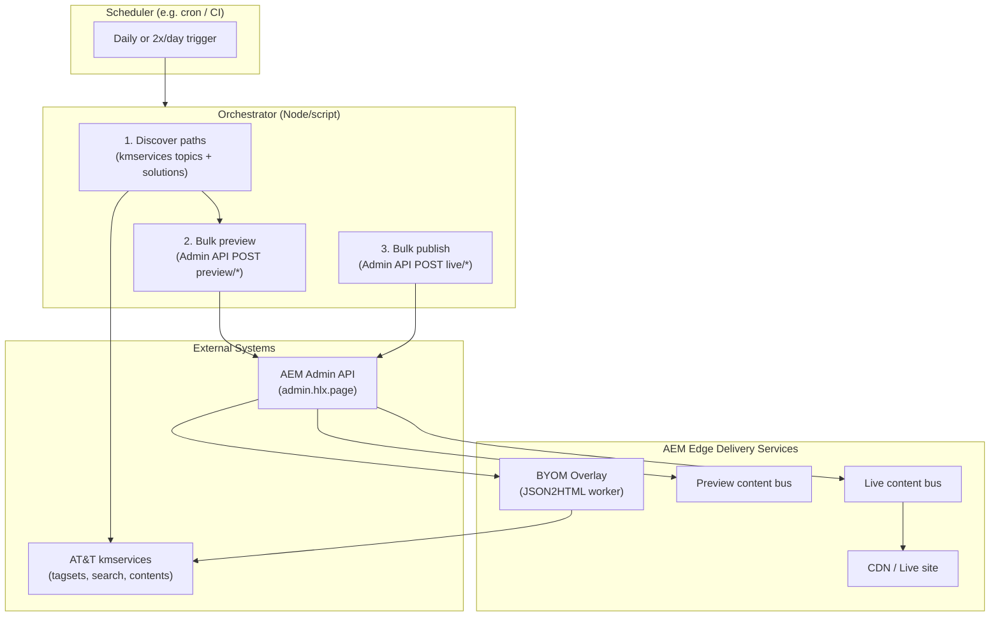
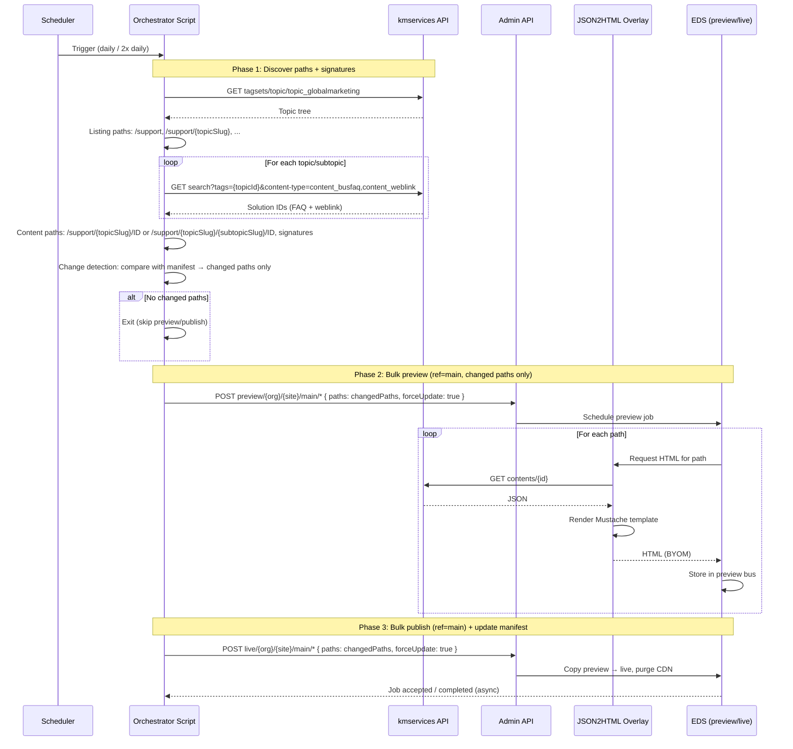
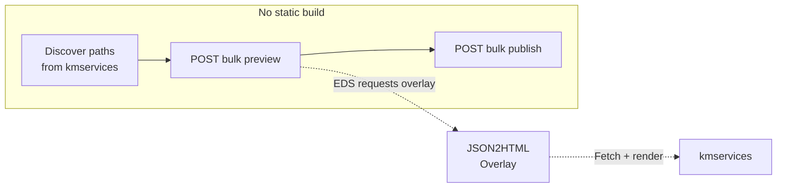
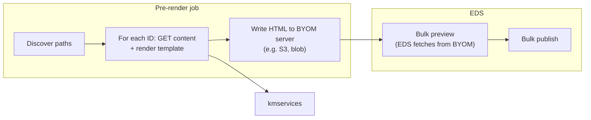
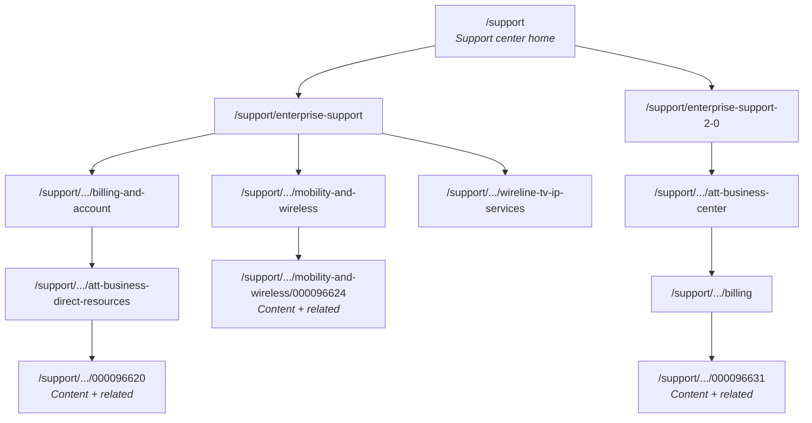
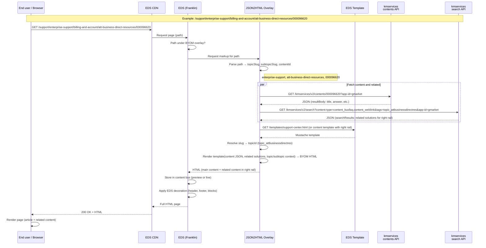
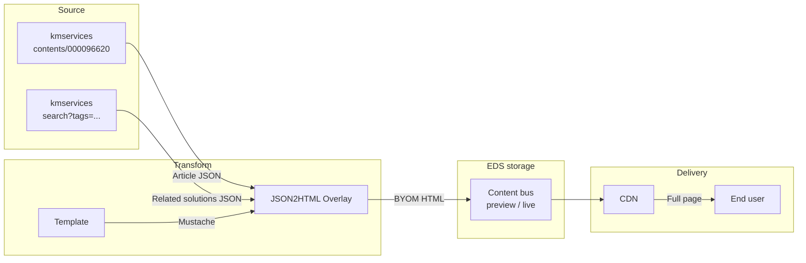
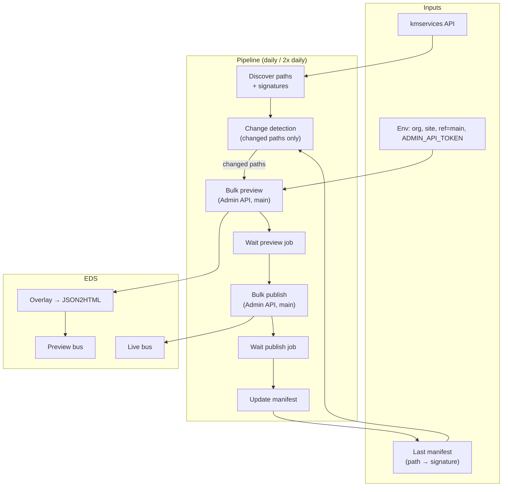

# Support Center: Periodic Build, Preview & Publish to EDS — Solution Recommendation

This document describes a **solution recommendation** for building/updating AT&T Support Center pages **periodically** (daily or twice daily), then **previewing** and **publishing** the resulting markup to Adobe Edge Delivery Services (EDS) using the [AEM Admin API](https://www.aem.live/docs/admin.html). It addresses the current single-page application (SPA) at [business.att.com/support/supportcenter.html](https://www.business.att.com/support/supportcenter.html), which is **not fully SEO compliant** because content is client-rendered and URLs are hash/query-based.

---

## 1. Executive Summary

| Aspect | Current State | Target State |
|--------|----------------|--------------|
| **Rendering** | Client-side SPA (support.js + jQuery) | Server-rendered or pre-rendered HTML per path (EDS/BYOM) |
| **URLs** | `?topic#id`, `?subtopic#id`, `?content!id#topic` | Path-based: `/support`, `/support/{topicSlug}/{contentId}` or `/support/{topicSlug}/{subtopicSlug}/{contentId}` so **related content** (right rail) is topic/subtopic-specific. |
| **SEO** | Limited (single shell, hash/query) | Full (one HTML document per logical page, crawlable) |
| **Content source** | Live kmservices API on every page load | Pre-built or on-demand HTML; kmservices used at build/preview time |
| **Update cadence** | Real-time (API on load) | Periodic (daily or twice daily); **only changed paths** preview/publish |
| **Paths** | Single shell + hash/query | **Listing pages** (`/support`, `/support/{topicSlug}`, …) + **content pages** with **topic/subtopic in URL** (`/support/{topicSlug}/{contentId}` or `…/{subtopicSlug}/{contentId}`) so **related content** (right rail) is topic/subtopic-specific. |

**Recommended approach:** Use the existing **BYOM overlay** (JSON2HTML worker) for on-demand HTML, and run a **scheduled job** that (1) discovers **listing** and **content** paths from kmservices — with **topic or subtopic in the content URL** so **related content** on the right is topic/subtopic-specific — (2) **change detection** (manifest; only changed paths), (3) **bulk preview** for changed paths only (ref = **main**), (4) **bulk publish**, and (5) **update manifest**. No separate BYOM static server; **listing pages** and **content paths with topic/subtopic segments** require overlay path(s) and template(s) that parse and use topic/subtopic for the right rail.

---

## 2. Current Implementation Analysis

### 2.1 SPA and support.js

The support center is a **single page application** that:

- Loads one HTML shell (`supportcenter.html`).
- Uses **support.js** to drive navigation and content.
- Reads URL state from **query** (`?topic`, `?subtopic`, `?content!id`) and **hash** (`#topicId`).
- Fetches all data from **AT&T kmservices** APIs at runtime.

### 2.2 kmservices API Usage (support.js)

| Config key | URL | Purpose |
|------------|-----|---------|
| `topicsURL` | `https://services.att.com/kmservices/v2/tagsets/topic/topic_globalmarketing?app-id=gmarket` | Topic tree (main nav: topics and subtopics) |
| `solutionsUrl` | `https://services.att.com/kmservices/v2/search?content-type=content_busfaq,content_weblink&description=y&tags={topicId}&app-id=gmarket` | Solutions (FAQ/weblink) per topic |
| `topicInfoUrl` | `https://services.att.com/kmservices/v2/search?content-type=content_topicinfo&description=y&tags={topicId}&app-id=gmarket` | Topic/subtopic descriptions |
| `contentUrl` | `https://services.att.com/kmservices/v2/contents/{contentId}?app-id=gmarket` | Single content (FAQ body, weblink URL, etc.) |

**Data flow in the SPA:**

1. **getTopics()** → topic tree (e.g. `topic_attbusinesscenter0`, children).
2. **display()** → reads hash/query, then either:
   - **displaySubtopics(topicId)** → topic + children (uses topicInfo for descriptions), or
   - **displaySolutions(topicId)** → **getSolutions(topicId)** (search API) and renders solution list, or
   - **displayContent(contId, topicId)** → **getContent(contId)** (contents API) and renders article.
3. Navigation and breadcrumbs are built from the topic tree and current topic/content.

**SEO limitations:**

- One HTML document; crawlers see the shell, not per-article content.
- URLs are not path-based; sharing and indexing are weaker.
- No per-page meta (title, description) in initial HTML for article views (only updated client-side in `getContent`).

### 2.3 Existing EDS/BYOM Setup (from project docs)

The project already has:

- **BYOM overlay** pointing to the **JSON2HTML worker** (e.g. `https://json2html.adobeaem.workers.dev/{org}/{site}/{ref}`).
- **Path pattern** `/support/supportcenter/` with regex `/[^/]+$/` → last segment = content ID (current; no topic/subtopic in path).

**Required change for topic/subtopic in URL:** Content pages must include **topic (and optionally subtopic) in the URL segment** so that the **related content** on the right can be populated specifically for that topic or subtopic (same as support.js: `displaySolutionsMenu(topicId, solutionId)` shows solutions for that topic). Therefore:

- **Content under a topic only** (no subtopics): path = `/support/{topicSlug}/{contentId}`. Overlay extracts `topicSlug` and `contentId`; fetches content by `contentId` and **solutions for that topic** for the right rail.
- **Content under a subtopic:** path = `/support/{topicSlug}/{subtopicSlug}/{contentId}`. Overlay extracts `topicSlug`, `subtopicSlug`, and `contentId`; fetches content by `contentId` and **solutions for that subtopic** for the right rail.

Overlay path pattern(s) and regex (or multiple config entries) must match `/support/...` and parse segments to get `topicSlug`, optional `subtopicSlug`, and `contentId`. Endpoint remains `contents/{{id}}`; template (or overlay logic) also needs `topicId`/`subtopicId` (from slug or lookup) to fetch related solutions and render the right rail. **Listing pages** require separate overlay path(s) and template(s).

---

## 3. Goal: Periodic Build + Preview + Publish to EDS

Requirements:

1. **Build/update** the set of support pages on a **schedule** (e.g. daily or twice daily).
2. **Preview** the resulting markup in EDS (preview environment).
3. **Publish** the preview to live using the **AEM Admin API**.

So we need:

- A **discovery** step: derive the full list of URLs (paths) that should exist — **listing pages** (e.g. `/support`, `/support/{topicSlug}`, `/support/{topicSlug}/{subtopicSlug}`) and **content pages** with **topic/subtopic in the path** (e.g. `/support/{topicSlug}/{contentId}` or `/support/{topicSlug}/{subtopicSlug}/{contentId}`) so the **related content** on the right is populated specifically for that topic or subtopic.
- A **change detection** step: compare each path with last-known state (e.g. last-modified from kmservices or stored manifest); **only preview/publish changed paths**.
- A **refresh** step: tell EDS to update **preview** for changed paths only (EDS pulls from overlay/JSON2HTML).
- A **publish** step: tell EDS to copy **preview → live** for those same changed paths.

**Decisions (confirmed):** Listing pages = yes; include weblinks (content_weblink) in content paths; no special rate-limit handling for now; only update changed paths; ref = **main**.

Admin API (from [AEM Admin API](https://www.aem.live/docs/admin.html)):

- **POST** `https://admin.hlx.page/preview/{org}/{site}/{ref}/{path}` — update preview for one path (EDS fetches from content source/overlay).
- **POST** `https://admin.hlx.page/preview/{org}/{site}/{ref}/*` — bulk preview (body: `{ "paths": ["/support/business-internet/123", "/support/business-internet/dedicated-internet/456", ...], "forceUpdate": true }`). Use **ref = main**.
- **POST** `https://admin.hlx.page/live/{org}/{site}/{ref}/{path}` — publish one path (preview → live).
- **POST** `https://admin.hlx.page/live/{org}/{site}/{ref}/*` — bulk publish (body: `{ "paths": [...], "forceUpdate": true }`).

Authentication: cookie (browser login) or **Authorization: token {API_KEY}** (Admin API key with publish/preview permissions).

---

## 4. High-Level Architecture

### 4.1 System Context



### 4.2 End-to-End Flow (Mermaid)



### 4.3 Option A vs Option B (Visual)

**Option A — Scheduled preview/publish only (recommended)**  
Reuse existing overlay. Orchestrator only calls Admin API; EDS + overlay do the rest.



**Option B — Pre-render to BYOM server, then preview/publish**  
Orchestrator (or separate job) calls kmservices, renders HTML, uploads to a BYOM-visible server. EDS content source = that BYOM URL. Then bulk preview/publish.



**Recommendation:** Start with **Option A** (scheduled preview/publish, overlay unchanged). It reuses JSON2HTML, avoids running a BYOM server, and meets “build/update periodically then preview and publish.” Option B is viable if you need fully static HTML under your control or must avoid on-demand overlay calls at preview time.

---

## 5. Detailed Data Flow

### 5.1 Path discovery (aligned with support.js)

Discovery produces **listing paths** and **content (article) paths**. **Topic or subtopic is part of the content URL** so that the **related content** on the right (solutions for that topic/subtopic) can be populated correctly by the overlay/template.

**Content paths (FAQ + weblink) — topic/subtopic in URL:**

- When a solution (FAQ or weblink) belongs to a **topic that has no subtopics**, use path **`/support/{topicSlug}/{contentId}`**. The overlay can then fetch content by `contentId` and **related solutions** by that topic’s `systemCode` to render the right rail.
- When a solution belongs to a **subtopic**, use path **`/support/{topicSlug}/{subtopicSlug}/{contentId}`**. The overlay can fetch content by `contentId` and **related solutions** by that subtopic’s `systemCode` to render the right rail.

**Include both content_busfaq and content_weblink** so weblinks get their own SEO-friendly pages. Because discovery iterates per topic/subtopic and gets solutions for each, we know the owning topic (and subtopic if any) for every `publishedId`, so we can build the correct path with topic/subtopic segments.

**Listing paths:** Add SEO-friendly listing pages:
- **Main:** `/support` (or `/support/`) — support center home / topic list.
- **Topic listing:** For each **topic** (top-level nav node), add e.g. `/support/{topicSlug}` (e.g. `/support/business-internet`). Slug from `systemCode` or `displayTagName` (e.g. `topic_businessinternet` → `business-internet`).
- **Subtopic listing:** For each **subtopic** (child of a topic), add e.g. `/support/{topicSlug}/{subtopicSlug}` (e.g. `/support/business-internet/dedicated-internet`).

Listing pages require **extra overlay path(s)** and **template(s)** in the JSON2HTML config. Content pages require overlay path(s) that match `/support/{topicSlug}/{contentId}` and `/support/{topicSlug}/{subtopicSlug}/{contentId}` and pass topic/subtopic + contentId to the template so it can fetch related solutions for the right rail.

**Related content (right rail):** In the current SPA, `displayContent(contId, topicId)` calls `displaySolutionsMenu(topicId, solutionId)`, which populates “Related content” with solutions for that **topic** (or subtopic). By putting **topic (and subtopic) in the URL**, the overlay receives the same context: from the path it gets `topicSlug` and optionally `subtopicSlug`, can resolve to `topicId`/`subtopicId` (e.g. from a slug→systemCode map or API), and can call the solutions search API for that topic/subtopic to render the right rail with the correct related items.

Logic (pseudo):

```text
paths = []
topicTree = GET kmservices/v2/tagsets/topic/topic_globalmarketing

// Listing: main
paths.push("/support")

// Listing + Content: per topic and per subtopic (topic/subtopic in URL for related content)
for each topic in topicTree.children:
  topicSlug = toSlug(topic)
  paths.push("/support/" + topicSlug)

  if topic.children exists and topic.children.length > 0:
    // Topic has subtopics: solutions live under subtopics
    for each subtopic in topic.children:
      subtopicSlug = toSlug(subtopic)
      paths.push("/support/" + topicSlug + "/" + subtopicSlug)
      solutions = GET kmservices/v2/search?content-type=content_busfaq,content_weblink&tags={subtopic.systemCode}&app-id=gmarket
      for each hit in solutions.searchResults:
        paths.push("/support/" + topicSlug + "/" + subtopicSlug + "/" + hit.publishedId)
  else:
    // Topic has no subtopics: solutions live under topic
    solutions = GET kmservices/v2/search?content-type=content_busfaq,content_weblink&tags={topic.systemCode}&app-id=gmarket
    for each hit in solutions.searchResults:
      paths.push("/support/" + topicSlug + "/" + hit.publishedId)

paths = unique(paths)
```

### 5.2 Change detection (only update changed paths)

**Goal:** Only preview and publish paths whose content has changed since the last run.

**Approach:**

1. **Store a manifest** after each run: for each path, store a **signature** (e.g. `lastModified` from kmservices, or a hash of the content). Persist as JSON (e.g. `manifest.json` in repo or blob storage). Key: path → `{ lastModified, contentId? }`.
2. **Listing pages:** If kmservices exposes last-modified for topic/subtopic metadata, use it. Otherwise use topic tree version or a hash of the topic tree structure + descriptions. If not available, treat listing paths as “changed” when the topic tree or any solution set changes (e.g. run discovery and diff path set + topic tree hash).
3. **Content pages:** For each content path, call kmservices `GET .../contents/{id}` (or use search result metadata if it includes last-modified). Compare `lastModified` (or equivalent) with the value in the manifest. If missing or newer, mark path as changed.
4. **Output:** A list of **changed paths** only. If no manifest exists (first run), treat all discovered paths as changed.

**Optimization:** Batch content metadata (e.g. search API may return last-modified for many items in one call) to avoid one request per content ID when building the changed set.

### 5.3 Preview and publish

- **Preview:** `POST https://admin.hlx.page/preview/{org}/{site}/{ref}/*` with **ref = main** and body:
  - `paths`: array of **changed paths only** (from change detection).
  - `forceUpdate`: `true` so EDS refreshes.
- **Publish:** After preview job has processed (poll job status if needed), `POST https://admin.hlx.page/live/{org}/{site}/{ref}/*` with same **changed paths** and `forceUpdate: true`.

If **no paths changed**, skip preview and publish (or no-op). Bulk operations are **asynchronous**; poll `GET .../job/{org}/{site}/{ref}/preview/{jobName}` and same for `live` until state is completed before updating the manifest.

### 5.4 Sample EDS site structure (outcome)

Once the support center pages are curated and published to EDS, the site will have the following URL structure. **Listing pages** show topic/subtopic navigation and solution lists; **content pages** show the article (FAQ or weblink) with **related content** on the right specific to that topic or subtopic.

Slugs below are derived from the kmservices topic tree (e.g. `topic_enterprisesupport` → `enterprise-support`, `topic_billingandaccount` → `billing-and-account`). Content IDs (e.g. `000096620`) are placeholders; real IDs come from the solutions search API.

```text
/support                                    ← Listing: Support center home (topic list)

/support/enterprise-support                 ← Listing: Enterprise Support (subtopic list or solution list if no subtopics)
/support/enterprise-support/billing-and-account                    ← Listing: Billing and Account (subtopic list)
/support/enterprise-support/billing-and-account/att-business-direct-resources   ← Listing: AT&T BusinessDirect resources (solution list)
/support/enterprise-support/billing-and-account/att-business-direct-resources/000096620   ← Content: article; right rail = solutions for this subtopic
/support/enterprise-support/billing-and-account/att-business-direct-resources/000096621
/support/enterprise-support/billing-and-account/att-premier-resources
/support/enterprise-support/billing-and-account/att-premier-resources/000096622
/support/enterprise-support/billing-and-account/att-business-center-resources
/support/enterprise-support/billing-and-account/att-business-center-resources/000096623

/support/enterprise-support/mobility-and-wireless                  ← Listing: Mobility and Wireless (no subtopics → solution list)
/support/enterprise-support/mobility-and-wireless/000096624         ← Content: article; right rail = solutions for this topic
/support/enterprise-support/mobility-and-wireless/000096625

/support/enterprise-support/repair-or-troubleshoot
/support/enterprise-support/repair-or-troubleshoot/000096626

/support/enterprise-support/wireline-tv-ip-services                ← Listing: Wireline, TV, IP Services
/support/enterprise-support/wireline-tv-ip-services/advanced-solutions-enterprise-care
/support/enterprise-support/wireline-tv-ip-services/advanced-solutions-enterprise-care/000096627
/support/enterprise-support/wireline-tv-ip-services/att-connect
/support/enterprise-support/wireline-tv-ip-services/att-connect/000096628
/support/enterprise-support/wireline-tv-ip-services/att-global-network-client
/support/enterprise-support/wireline-tv-ip-services/directv-for-business
/support/enterprise-support/wireline-tv-ip-services/directv-for-business/billing-and-account
/support/enterprise-support/wireline-tv-ip-services/directv-for-business/billing-and-account/000096629
/support/enterprise-support/wireline-tv-ip-services/directv-for-business/programming
/support/enterprise-support/wireline-tv-ip-services/directv-for-business/troubleshoot-and-repair
/support/enterprise-support/wireline-tv-ip-services/directv-for-business/troubleshoot-and-repair/000096630

/support/enterprise-support-2-0                                     ← Listing: Enterprise Support 2.0
/support/enterprise-support-2-0/att-business-center
/support/enterprise-support-2-0/att-business-center/billing
/support/enterprise-support-2-0/att-business-center/billing/000096631
/support/enterprise-support-2-0/att-business-center/get-started
/support/enterprise-support-2-0/att-business-center/orders
/support/enterprise-support-2-0/att-business-center/payments
/support/enterprise-support-2-0/att-business-center/reporting
/support/enterprise-support-2-0/att-business-center/troubleshoot-repair
/support/enterprise-support-2-0/att-business-center/troubleshoot-repair/000096632

… (further topics and subtopics from the full topic tree)
```

**Legend:**

| Path shape | Page type | Right rail / related content |
|------------|-----------|------------------------------|
| `/support` | Listing | — (topic list) |
| `/support/{topicSlug}` | Listing | Subtopic list, or solution list if topic has no subtopics |
| `/support/{topicSlug}/{subtopicSlug}` | Listing | Solution list for that subtopic |
| `/support/{topicSlug}/{contentId}` | Content | Related content = solutions for **that topic** |
| `/support/{topicSlug}/{subtopicSlug}/{contentId}` | Content | Related content = solutions for **that subtopic** |

**Mermaid — site structure (simplified):**



### 5.5 Example: single support page — source to EDS to end user

This section traces **one example entity** — a content page — from the **source** (kmservices) through the **overlay** (JSON2HTML), **storage** on EDS (content bus), and **delivery** to the **end user**.

**Example entity:**

- **Path:** `/support/enterprise-support/billing-and-account/att-business-direct-resources/000096620`
- **Type:** Content page (FAQ or weblink)
- **Parsed segments:** `topicSlug` = `enterprise-support`, `subtopicSlug` = `att-business-direct-resources`, `contentId` = `000096620`
- **Related content context:** subtopic `topic_attbusinessdirectres` (AT&T BusinessDirect resources) — right rail shows solutions for this subtopic.

**Detailed data flow (sequence diagram):**



**Flow summary (same example):**

| Step | Actor | Action | Entity / data |
|------|--------|--------|----------------|
| 1 | End user | Requests page | Path: `.../att-business-direct-resources/000096620` |
| 2 | EDS | Receives request, resolves overlay | Path under BYOM → ask overlay for markup |
| 3 | Overlay | Parses path | `topicSlug`, `subtopicSlug`, `contentId` |
| 4 | Overlay | Fetches main content | GET kmservices `contents/000096620` → article JSON |
| 5 | Overlay | Fetches related content | GET kmservices `search?tags=topic_attbusinessdirectres` → solutions for right rail |
| 6 | Overlay | Fetches template | GET EDS `templates/support-center.html` (or template with right rail) |
| 7 | Overlay | Renders | Mustache(template, content + related + context) → BYOM HTML |
| 8 | Overlay | Returns | HTML to EDS |
| 9 | EDS | Stores | HTML in content bus (preview or live partition) |
| 10 | EDS | Serves | Full page (with decoration) via CDN to user |
| 11 | End user | Sees | Support page with article and topic/subtopic-specific related content |

**Visual: entity journey (flowchart):**



---

## 6. Dependencies

| Dependency | Role |
|------------|------|
| **Node.js** (LTS) | Run orchestrator script (discovery + Admin API calls). |
| **AT&T kmservices** | Tagsets, search, contents APIs (same as support.js); network access from runner. |
| **AEM Admin API** | Preview and publish; requires auth (API key or cookie). |
| **Admin API key** | Create via Admin API (e.g. POST config/{org}/sites/{site}/apiKeys.json) with roles that include **publish** (and preview if needed). Store in secrets (e.g. env var). |
| **EDS site** | BYOM overlay → JSON2HTML worker. **Content pages** must use paths with **topic/subtopic in URL**: `/support/{topicSlug}/{contentId}` or `/support/{topicSlug}/{subtopicSlug}/{contentId}` so the overlay can fetch related solutions for the right rail. Overlay path pattern(s) and template(s) must parse these segments and pass topic/subtopic + contentId. **Listing pages** require additional overlay path(s) and template(s) for `/support`, `/support/{topicSlug}`, etc. |
| **Ref** | Use **ref = main** for all Admin API preview and publish calls. |
| **Manifest storage** | Persist path → signature (e.g. `manifest.json` in repo or blob storage) for change detection; update after each successful publish. |
| **Scheduler** | Cron, GitHub Actions, Jenkins, or similar to run the script daily or twice daily. |
| **Optional: @adobe/helix-admin-api** or raw `fetch` | Call Admin API (bulk preview, bulk publish, job status). |

No change to **JSON2HTML worker** or **support-center.html** for **content** pages; **listing** pages require new overlay path(s) and template(s). Change detection and ref=main are required per decisions.

---

## 7. Implementation Steps

### Step 1: Admin API authentication

- Create an Admin API key for the EDS site (org/site) with **publish** (and **preview**) permissions.
- Store the key securely (e.g. `ADMIN_API_TOKEN` in CI secrets).
- Verify: `GET https://admin.hlx.page/preview/{org}/{site}/{ref}/` (or a known path) with `Authorization: token {key}`.

### Step 2: Path discovery script

- Implement a script (e.g. Node) that:
  - Calls `GET .../kmservices/v2/tagsets/topic/topic_globalmarketing?app-id=gmarket`.
  - **Listing paths:** Adds `/support` and, for each topic/subtopic, `/support/{topicSlug}` and `/support/{topicSlug}/{subtopicSlug}` (slug from `systemCode` or `displayTagName`).
  - **Content paths:** For each topic (and each subtopic when present), calls search API with `content-type=content_busfaq,content_weblink`; for each `publishedId`, adds path **with topic/subtopic in URL**: `/support/{topicSlug}/{id}` (topic only) or `/support/{topicSlug}/{subtopicSlug}/{id}` (subtopic), so related content on the right is topic/subtopic-specific. Include **both FAQ and weblink**.
  - For change detection: for each path, obtain a **signature** (e.g. `lastModified` from kmservices contents API or search result metadata; for listing pages, topic tree hash or last-modified if available).
  - Outputs a JSON structure: `{ paths: [{ path, signature }], ... }` (or writes to a file).
- Handle errors; no special rate-limit handling required for now.

### Step 3: Change detection script

- Load **last run manifest** (e.g. `manifest.json` from repo or blob): path → signature.
- Compare current discovery output (path + signature) with manifest. Path is **changed** if: missing in manifest, or signature differs.
- Output **changed paths only** (array of path strings). If no manifest (first run), all discovered paths are changed.
- If no changed paths, exit early (skip preview/publish).

### Step 4: Bulk preview script

- Read **changed paths** (from Step 3). If empty, skip.
- Call `POST https://admin.hlx.page/preview/{org}/{site}/{ref}/*` with **ref = main**:
  - `Content-Type: application/json`
  - `Authorization: token {ADMIN_API_TOKEN}`
  - Body: `{ "paths": ["/support", "/support/business-internet/123", "/support/business-internet/dedicated-internet/456", ...], "forceUpdate": true }`
- Parse response for job id; poll job status until done (or timeout).

### Step 5: Bulk publish script

- After preview job completes, call `POST https://admin.hlx.page/live/{org}/{site}/{ref}/*` with **ref = main** and the same **changed paths** and `forceUpdate: true`.
- Poll publish job status until done.

### Step 6: Update manifest and orchestrator

- After successful publish, **update manifest**: for each changed path, set manifest[path] = current signature. Persist manifest (e.g. commit `manifest.json` or upload to blob).
- Combine Steps 2–5 into one orchestrator (e.g. `node run-periodic-build.js`):
  1. Discover paths + signatures.
  2. Compute changed paths; if none, exit.
  3. Bulk preview (main).
  4. Wait for preview job.
  5. Bulk publish (main).
  6. Wait for publish job.
  7. Update manifest.
  8. Log success/failure.
- Schedule the orchestrator:
  - **Cron:** e.g. `0 2,14 * * *` (2:00 and 14:00 daily).
  - **GitHub Actions:** workflow on `schedule` and optionally on manual dispatch.
  - **Other:** Jenkins, etc. Use **ref = main** in all Admin API calls.

### Step 7: Monitoring and alerts

- On failure (discovery error, non-2xx from Admin API, job failed), send alert (email, Slack, etc.).
- Optionally: store last run timestamp and path count in a small report artifact.

---

## 8. Mermaid: Full Pipeline Overview



---

## 9. Assumptions and Decisions

### Assumptions

- EDS site uses BYOM overlay (JSON2HTML worker). **Content URLs include topic (and subtopic)** so that related content on the right is populated specifically for that topic/subtopic; overlay and template must support `/support/{topicSlug}/{contentId}` and `/support/{topicSlug}/{subtopicSlug}/{contentId}`. **Listing pages** require additional overlay path(s) and template(s).
- kmservices APIs remain available and contract-compatible with current support.js usage.
- Admin API key can be created and has preview/publish permissions.
- “Build/update” means “refresh EDS preview (and then publish) for **changed** content and listing paths” rather than “generate and host static HTML on a separate BYOM server.”

### Decisions (answered)

| # | Question | Decision |
|---|----------|----------|
| 1 | **Listing pages** — SEO-friendly listing pages (e.g. `/support`, `/support/business-internet`)? | **Yes.** Include listing paths; add overlay path(s) and template(s) for topic/subtopic listing pages. |
| 2 | **Weblinks** — Create paths for `content_weblink` or only `content_busfaq`? | **Weblink.** Include both; content paths are created for FAQ and weblink items. |
| 3 | **Rate limits** — Throttling or chunking for bulk preview? | **No.** No special rate-limit handling for now. |
| 4 | **Idempotency** — Re-preview/publish all paths every run or only changed? | **Only changed paths.** Use change detection (manifest of path → signature; compare with kmservices last-modified or content hash); only preview and publish changed paths. |
| 5 | **Environment** — Which ref for preview and publish? | **main.** Use `ref = main` for all Admin API preview and publish calls. |

---

## 10. References

- [AEM Admin API](https://www.aem.live/docs/admin.html) — preview, publish, bulk jobs.
- [Bring Your Own Markup (BYOM)](https://www.aem.live/developer/byom) — HTML as content source/overlay.
- [App Builder Overview](https://developer.adobe.com/app-builder/docs/intro_and_overview/) — context for Adobe runtimes.
- Project: `support.js`, `JSON2HTML_ARCHITECTURE.md`, `SUPPORT_CENTER_EDS_SEO_APPROACH.md`, `json2html.rest`, `templates/support-center.html`.
