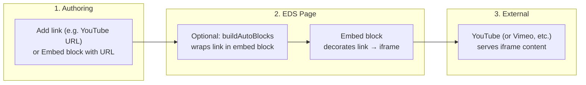

# YouTube and Video Embeds on EDS — Solution Design

This document provides a **solution design** for adding **YouTube and other embedded videos** to sites built on **AEM Edge Delivery Services (EDS)** with Universal Editor . The solution uses the **Embed block** from the [AEM Block Collection](https://www.aem.live/developer/block-collection) . No backend is required; embeds are rendered entirely on the client using the block’s decoration logic and third-party embed URLs (e.g. YouTube, Vimeo).

---

## 1. Current State and Goal

### 1.1 Goal

- **Objective:** Allow authors to add **YouTube** (and optionally Vimeo, Twitter, or generic iframe) content on EDS pages.
- **Author experience:** As simple as possible: author adds a **link** (e.g. `https://www.youtube.com/watch?v=VIDEO_ID` or `https://youtu.be/VIDEO_ID`) in the document, and the site renders an inline video embed. Alternatively, authors can add the **Embed block** explicitly via block table (e.g. from Sidekick Library).
- **Technical scope:** Use the **Embed block** from Block Collection; optionally add **auto-blocking** in `buildAutoBlocks()` so standalone links to YouTube (and other supported URLs) are wrapped in an embed block automatically.

### 1.2 Authoring Options (AEM Documentation)

Per [AEM Authoring and Publishing Content](https://www.aem.live/docs/authoring):

- **Images and videos:** Authors can add images by dragging them into the document. For **videos**, “Microsoft Word and Google Docs do not allow you to just drag and drop videos, but you can add videos via SharePoint or Google Drive, preview and publish them **using the Sidekick** and add the resulting URL as a link to a **suitable block** in your document.”
- The “suitable block” for **external video URLs** (e.g. YouTube, Vimeo) is the **Embed block** (or the **Video block** for AEM-hosted video). The Block Collection describes:
  - **[Embed](https://www.aem.live/developer/block-collection/embed)** — “A simple way to embed social media content into AEM pages” (YouTube, Vimeo, Twitter, etc.).
  - **[Video](https://www.aem.live/developer/block-collection/video)** — “Display and playback videos directly from AEM” (for content stored in AEM/Drive, not for YouTube URLs).

For **YouTube and similar external URLs**, the correct block is **Embed**.

### 1.3 Auto-Blocking (Link → Embed Block)

Per [Markup, Sections, Blocks, and Auto Blocking](https://www.aem.live/developer/markup-sections-blocks):

- “Another very common use case is to wrap blocks around **links** in a document. A good example is an **author linking to a YouTube video by simply including a link**, while the developer would like to keep all the code for the video inline embed in an **embed** block.”
- “This mechanism can also be used as a flexible way to include both external applications and internal references to video, content fragments, modals, forms, and other application elements.”
- The code for auto-blocking lives in **`buildAutoBlocks()`** in the project’s **`scripts.js`**.

So the intended pattern is: **author adds a link** → **auto-blocking** (if implemented) wraps that link in an **embed** block → **Embed block** decorates the link into an inline iframe/embed.

---

## 2. Target Architecture: Embed Block + Optional Auto-Blocking

### 2.1 Approach

| Layer | Role |
|-------|------|
| **Authoring** | Author adds a **link** (e.g. YouTube URL) in the document, **or** adds an **Embed** block (e.g. from Sidekick Library) with the URL in the first cell. |
| **Auto-blocking** (optional) | In `buildAutoBlocks(main)`, detect standalone links whose `href` matches YouTube (and optionally Vimeo, etc.) and wrap each in an **embed** block structure so the block loader picks it up. |
| **Embed block** | From [Block Collection](https://github.com/adobe/aem-block-collection/tree/main/blocks/embed) (or project copy). Reads the link from the block, resolves provider (YouTube, Vimeo, Twitter), and renders the appropriate iframe/embed. Uses **IntersectionObserver** (or placeholder + click) so third-party scripts/iframes load when in view — aligned with [good practices](https://www.aem.live/docs/dev-collab-and-good-practices) (no third-party in `<head>`, load where needed). |
| **Sidekick Library** | Authors can open the [Sidekick Library](https://www.aem.live/docs/sidekick-library) for the Block Collection and use the **Embed** block entry to **copy** the block table structure, then paste into the document and fill in the video URL. |

No backend or Edge Worker is involved; the Embed block runs entirely in the browser.

### 2.2 High-Level Flow

**Flow summary:**

| Step | What happens |
|------|----------------|
| **1. Author** | Adds a YouTube (or Vimeo, etc.) **link** in the document, or adds an **Embed** block (e.g. from Sidekick Library) with the URL in the first cell. |
| **2. EDS** | If auto-blocking is implemented, `buildAutoBlocks()` wraps matching links in an embed block. The **Embed block** decorator runs, reads the link, and injects the correct iframe/embed markup. |
| **3. External** | The browser loads the iframe; YouTube (or other provider) serves the video player. No EDS backend call. |

---

## 3. Block Design: Embed Block (Block Collection)

### 3.1 Content Model (Authored as Block Table or Single Link)

The Block Collection **Embed** block expects:

| Content | Purpose |
|---------|---------|
| **Link (required)** | One anchor (`<a href="...">`) with URL pointing to YouTube, Vimeo, Twitter, or any URL for generic iframe. |
| **Picture (optional)** | If present, the block can show a **placeholder** image and load the embed on click (e.g. with autoplay). Otherwise, the block typically loads the embed when it enters the viewport (IntersectionObserver). |

Authors can:

- **Option A:** Add a single **link** in the document (e.g. `https://www.youtube.com/watch?v=VIDEO_ID`). If auto-blocking is implemented, this link is wrapped in an embed block.
- **Option B:** Add an **Embed** block explicitly: first row = block name `Embed`, next row = one cell containing the link (and optionally a picture). Structure can be copied from the [Sidekick Library — Embed](https://sidekick-library--aem-block-collection--adobe.aem.page/tools/sidekick/library.html?plugin=blocks&path=/block-collection/embed&index=0).

### 3.2 Block Behavior (Block Collection Reference)

From the [Block Collection embed block](https://github.com/adobe/aem-block-collection/tree/main/blocks/embed):

- **Supported URLs:** YouTube (`youtube.com`, `youtu.be`), Vimeo (`vimeo.com`), Twitter (`twitter.com`). Other URLs fall back to a **default embed** (generic iframe).
- **Performance:** Embed is **not** loaded in `<head>`. The block uses **IntersectionObserver** to load the iframe when the block enters the viewport, or a **placeholder + click** to load (with optional autoplay). Aligns with [Loading 3rd party libraries](https://www.aem.live/docs/dev-collab-and-good-practices) (load where needed, consider IntersectionObserver for larger content).
- **Decoration:** Block reads `block.querySelector('a').href`, clears the block content, and replaces it with the appropriate iframe/embed markup (or placeholder). No hard-coded user-facing strings that need to be authorable beyond the URL.

### 3.3 YouTube-Specific Details

- **URL forms:** `https://www.youtube.com/watch?v=VIDEO_ID` or `https://youtu.be/VIDEO_ID`.
- **Rendering:** Block builds the standard YouTube embed URL (e.g. `https://www.youtube.com/embed/VIDEO_ID`) and injects an `<iframe>` with that `src`. Optional query params (e.g. `muted=1&autoplay=1` for click-to-play) can be applied by the block when using a placeholder.

---

## 4. Auto-Blocking: Wrapping Links in the Embed Block

### 4.1 Purpose

So that authors can add a video by **only** adding a link (no block table), the project can implement auto-blocking that:

1. Finds links in `main` that point to YouTube (and optionally Vimeo, etc.).
2. Wraps each such link in the **DOM structure** of an embed block (so that after `decorateSections` / `decorateBlocks`, the block loader loads the Embed block and runs its `decorate(block)`).

### 4.2 Implementation Pattern

Auto-blocking runs in **`buildAutoBlocks(main)`** in **`scripts.js`**, **before** `decorateSections` and `decorateBlocks`. Typical steps:

1. Select links that are **standalone** (e.g. in a paragraph or default content) and whose `href` matches a list of embed patterns (e.g. `youtube.com`, `youtu.be`, `vimeo.com`).
2. For each link, create a **section** and **block** structure that matches what the block loader expects for **embed** (e.g. a `div` with class `embed` containing a single row with the link).
3. Replace the link (or its parent paragraph) with this new section so that `decorateBlocks` later finds a `.block.embed` and loads `blocks/embed/embed.js`.

Reference examples for auto-blocking are cited in the AEM docs: [Adobe Blog](https://github.com/adobe/blog/blob/3f4318d622e2626aca65c239ad0bf2b4b45012a2/scripts/scripts.js#L823-L852), [AEM Boilerplate](https://github.com/adobe/aem-boilerplate).

### 4.3 Link Selection Rules

- **Include:** Links whose `href` contains (e.g.) `youtube.com`, `youtu.be`, `vimeo.com` (and optionally `twitter.com` if the Embed block supports it). Exclude links that are **already inside** an existing embed block to avoid double-wrapping.
- **Scope:** Only links under `main`, and only in default content (e.g. inside `p`) so that normal in-text links are not all turned into embeds; the exact heuristic (e.g. “link in its own paragraph” vs “any matching link”) is a project choice.

---

## 5. Sidekick Library and Author Documentation

### 5.1 Sidekick Library (Block Collection)

- **URL:** [Sidekick Library — Embed block](https://sidekick-library--aem-block-collection--adobe.aem.page/tools/sidekick/library.html?plugin=blocks&path=/block-collection/embed&index=0)
- **Use:** Authors can open this page, use the **Copy** action for the **Embed** block to copy the block table structure, then paste into their document (Word, Google Docs, or Universal Editor) and replace the placeholder URL with the desired YouTube (or other) link.
- **Docs:** [Sidekick Library](https://www.aem.live/docs/sidekick-library) explains how to discover and copy block structures from the Block Collection.

### 5.2 Author-Facing Guidance

- **For “link only” (with auto-blocking):** “To add a YouTube video, add a link to the video in the document (e.g. paste the YouTube URL). The page will show the video inline.”
- **For “block table”:** “Use the Embed block: copy the Embed block from the Sidekick Library, paste it into your page, and put the video URL in the first cell. You can optionally add a preview image in the second cell for a click-to-play experience.”

---

## 6. EDS and Universal Editor Considerations

### 6.1 Universal Editor (UE) Crosswalk

- If the site uses **Universal Editor** for authoring, the same content model applies: authors still add either a **link** (for auto-block) or an **Embed block** with a URL cell. UE stores this as the same structure (link or block table) that EDS consumes; no extra backend is required for the embed itself.
- Block documentation in UE projects may use inline help or other mechanisms instead of the Sidekick Library; the **content structure** (link or Embed block with URL) remains the same.

### 6.2 No Backend or Edge Worker

- The Embed block does **not** call an EDS backend or an Edge Worker. It only:
  - Reads the authored link from the DOM.
  - Builds the correct embed URL (e.g. YouTube embed URL).
  - Injects an iframe (or placeholder + load on interaction).  
- CORS and secrets are not an issue for the embed itself; the browser loads the iframe from YouTube/Vimeo directly. Third-party scripts (e.g. Twitter widgets) are loaded via the block’s `loadScript()`-style pattern, not in `<head>`.

---

## 7. Best Practices Alignment

The solution aligns with [Development Collaboration and Good Practices](https://www.aem.live/docs/dev-collab-and-good-practices):

| Practice | Application |
|----------|-------------|
| **Content for strings** | The only authorable “content” for the embed is the **URL** (and optional image). No user-facing strings are hard-coded in the block; optional copy (e.g. “Play video”) can be kept minimal or in block code if needed. |
| **No third-party in `<head>`** | Embed and third-party scripts (e.g. Twitter) are loaded by the **Embed block** when needed (IntersectionObserver or on click), not via `head.html`. |
| **Loading 3rd party / IntersectionObserver** | Block Collection Embed uses IntersectionObserver (or placeholder + click) so iframes load when in view or on demand. |
| **Frameworks** | No framework in critical path; block is vanilla JS. |
| **CSS scoping** | Block CSS is scoped to the block (e.g. `.embed`). |
| **Mobile first** | Embed layout and styling should be responsive; Block Collection blocks are designed to work across breakpoints. |

---

## 8. Implementation Checklist (High-Level)

| # | Area | Action |
|---|------|--------|
| 1 | **Embed block** | Add **Embed** block to the project: copy from [aem-block-collection/blocks/embed](https://github.com/adobe/aem-block-collection/tree/main/blocks/embed) (`embed.js`, `embed.css`) into `blocks/embed/` and adjust if needed for project styling. |
| 2 | **Auto-blocking** | In `scripts.js`, inside `buildAutoBlocks(main)`, add logic to find standalone links matching YouTube (and optionally Vimeo, etc.), wrap each in an embed block structure, and replace in the DOM so `decorateBlocks` loads the Embed block. |
| 3 | **Link rules** | Define which URLs trigger auto-block (e.g. `youtube.com`, `youtu.be`, `vimeo.com`) and exclude links already inside `.embed`. |
| 4 | **Authoring** | Document for authors: (a) add a link for inline video (with auto-block), or (b) use Sidekick Library Embed block and paste structure, then set URL (and optional image). |
| 5 | **Sidekick Library** | If using Sidekick Library, point authors to the [Embed block entry](https://sidekick-library--aem-block-collection--adobe.aem.page/tools/sidekick/library.html?plugin=blocks&path=/block-collection/embed&index=0) for copy/paste. |
| 6 | **Testing** | Verify: (1) Link-only authoring → auto-block → Embed block renders YouTube. (2) Explicit Embed block with URL → renders. (3) Placeholder + click (if used) loads and autoplays. (4) No third-party script in `<head>`; LCP and performance remain acceptable. |

---

## 9. Resolved Decisions and Assumptions

### 9.1 Resolved

- **Block:** Use the **Embed** block from the AEM Block Collection (or project copy) for YouTube, Vimeo, Twitter, and generic iframe embeds. The **Video** block is for AEM-hosted video, not YouTube URLs.
- **Authoring:** Two paths supported: (1) **Link only** with auto-blocking, or (2) **Embed block** (e.g. from Sidekick Library) with URL in first cell.
- **Auto-blocking:** Implemented in `buildAutoBlocks(main)` in `scripts.js`, before section/block decoration; wraps matching links in embed block structure.
- **No backend / Edge Worker:** Embeds are rendered entirely in the browser; no EDS API or Edge Worker for the embed itself.
- **Performance:** Third-party content loads on viewport or on click via the block, not in `<head>`.

### 9.2 Assumptions

- The project uses (or will add) the Block Collection Embed block behavior (YouTube, Vimeo, etc.); any project-specific tweaks (e.g. extra URL patterns or params) are done in the project’s `blocks/embed/` copy.
- Authors have access to the Sidekick Library (or equivalent) if they use the explicit Embed block; otherwise they rely on pasting a link for auto-block.
- Universal Editor, if used, stores the same link or block table structure; no separate “embed” content type is required beyond the block structure described.

---

## 10. References

- [AEM Edge Delivery — Development collaboration and good practices](https://www.aem.live/docs/dev-collab-and-good-practices)
- [AEM — Authoring and Publishing Content](https://www.aem.live/docs/authoring) (Images and Videos, Blocks)
- [Markup, Sections, Blocks, and Auto Blocking](https://www.aem.live/developer/markup-sections-blocks) (embed block, auto-blocking for links)
- [Block Collection](https://www.aem.live/developer/block-collection) (Embed, Video)
- [Block Collection — Embed (GitHub)](https://github.com/adobe/aem-block-collection/tree/main/blocks/embed)
- [Sidekick Library](https://www.aem.live/docs/sidekick-library)
- [Sidekick Library — Embed block](https://sidekick-library--aem-block-collection--adobe.aem.page/tools/sidekick/library.html?plugin=blocks&path=/block-collection/embed&index=0)
- Project reference: `CHECK_AVAILABILITY_EDS_SOLUTION.md` (template pattern for EDS solution design)

---

*Document version: 1.0. YouTube and video embeds on EDS using Block Collection Embed block and optional auto-blocking; no backend or Edge Worker.*
